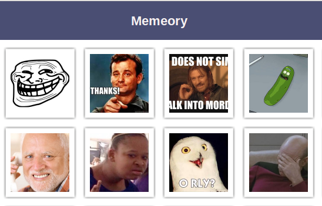
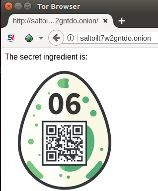
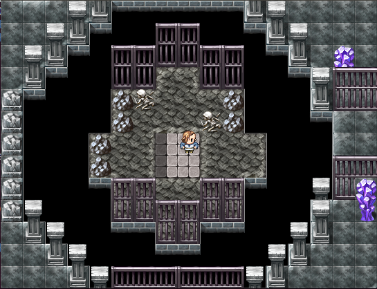
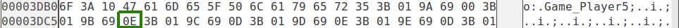
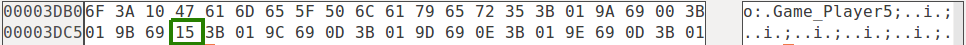
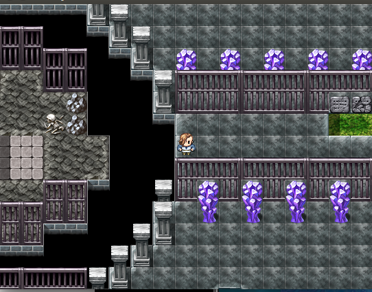
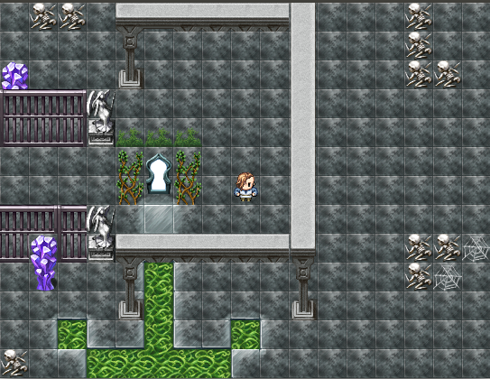
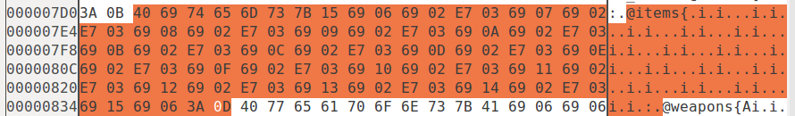
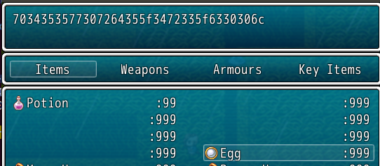
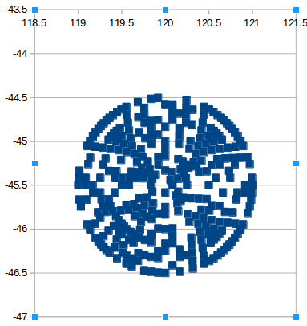

# Hacky Easter 2018 writeup

In March-May 2018, I participated in Hacky Easter run by [Hacking Lab](https://www.hacking-lab.com/index.html).  27 Challenges were available at various levels: easy, medium, hard and medium.

This was fun and a great learning experience.  I got a chance to learn and practice:

- Machine learning with tensorflow
- Padding Oracle Attacks on AES CBC
- Reverse engineer Android applications
- Calculate circle to square geometry mapping
- Create SHA1 collisions
- Step through ELF assemblies using debuggers
- Exploit weak RSA keys

As I worked on the challenges I took notes.  Below are the solutions to all challenges.  

*veganjay@gmail.com*

# 01 - Prison Break

## Challenge Description

Level: Easy

Your fellow inmate secretly passed you an old cell phone and a weird origami. The only thing on the phone are two stored numbers.

555-7747663 Link

555-7475464 Sara

Find the password and enter it in the Egg-o-Matic below. lowercase only, no spaces!


## Solution

A google search for "theres a plan to make all of this right prison break" reveals this [solution to this type of puzzle](http://www.givememyremote.com/remote/2006/09/26/prison-break-origami-code-broken/).


First look at the phone numbers:

7 7 5 7 6 6 3 7 4 7 5 4 6 4

The dots in the origami are:

. ... ... .... ... .. .. ... ... .... .. ... .. .

Count the number of dots in the origami:

1 3 3 4 3 2 2 3 3 4 2 3 2 1

The digits in the phone number represent the number on a telephone keypad, and the corresponding digit on the origami represents the nth letter on the keypad.

Looking at a telephone keypad:


For example, the first digit is "7", which has the letters "PQRS", and the first digit on the origami is "1", which represents "P".  The second digit in the phone number is also "7", and origami number is "3" which represents "R".  Continuing with the rest of the numbers yields the following result:

7 7 5 7 6 6 3 7 4 7 5 4 6 4

1 3 3 4 3 2 2 3 3 4 2 3 2 1

---------------------------

p r l s o n e r i s k i n g

The answer is "prlsonerisking".  However the code needed for the egg was "prisonerisking".  (Replaced the "l" with a "i")


# 02 - Babylon

## Challenge Description

Level: Easy

The tower is not the only thing in Babylon which has walls and shelves.

4 - 4 - 28 - 355

[babylon.txt](provided/babylon.txt)
 
## Solution

A google search of "The tower is not the only thing in Babylon which has walls and shelves." brought me to the [Library of Babel wiki page](https://en.wikipedia.org/wiki/The_Library_of_Babel).

Another google search for "Library of Babel" results in the [Library of Babel encoder/decoder page](https://libraryofbabel.info/).
On this page, navigate to "Browse".

Copy and paste the text from "babylon.txt" into the "Hex Name" field and hit enter.
In the drop downs, choose:

- Wall: 4
- Shelf: 4
- Volume: 28

Then select the page number "355".

The following is revealed:

*the super secret hackyeaster password is checkthedatayo*                     

Enter the password to get the egg on the form.


# 03 - Pony Coder

## Challenge Description

Level: Easy

Tony the pony has encoded something for you. Decode his message and enter it in the egg-o-matic below! Lowercase and spaces only, and special characters!

gn tn-gha87be4e

## Solution

The name of the challenge "Pony Coder" sounds similar to "Puny Coder".

I tried using a [web-based tool](https://www.punycoder.com/) and plugged the code in, but it did not work.  

So I did a little reading.  The [Wikipedia Punycode page](https://en.wikipedia.org/wiki/Punycode) brought me to the [Wikipedia Emoji domain](https://en.wikipedia.org/wiki/Emoji_domain) page which states:  *The ASCII representation starts with the prefix "xn--"*

Thus, I entered "xn--gn tn-gha87be4e" into the decoder web page which converts to "gìn tônì©"

The password thus is "gin tonic".


 
# 04 - Memeory

## Challenge description

Level: Easy

Fancy a round of memeory?

[Click here](https://hackyeaster.hacking-lab.com/hackyeaster/memeory/memeory.html) to play.

## Solution

Launch Burp, enter Proxy -> Options -> Enable Intercept of Server Responses

Navigate to the pages and observe the HTML response in Burp:
```
			<figure id="legespiel_card_0">
				<a href="#card_0">
				  
				  
				  
				   </a>
				  
			</figure>
```

Simply replace "boxFront" with "boxBack" and vice-versa.  Copy and paste the text into a file, and then open with vim.
Substitute using the following commands:
```
:%s/boxFront/boxTemp/g
:%s/boxBack/boxFront/g
:%s/boxTemp/boxBack/g
```

Open up the page and see that the images are all shown:


Click on matching pairs and finally get the egg.


# 05 - Sloppy & Paste

Level: Easy, Mobile Challenge

## Challenge description

The egg is right here. Just copy it!

## Solution

This is a mobile challenge.  Get the Android APK from the device:

```
$ adb shell pm list packages -f | grep hacky
package:/data/app/ps.hacking.hackyeaster.android-1/base.apk=ps.hacking.hackyeaster.android
$ adb pull /data/app/ps.hacking.hackyeaster.android-1/base.apk
[100%] /data/app/ps.hacking.hackyeaster.android-1/base.apk
```
Use apktool to extract the contents

```
$ apktool d base.apk
```

Inside the file base/assets/www/challenge05.html is the base64 encoded image for the egg.

```
$ cp challenge05.html egg05.txt
<Edit the file and retain only the base64 code>
$ base64 -d egg05.txt > egg05.png
```


# 06 - Cooking for Hackers

## Challenge Description

Level: Easy

You've found this recipe online:

    1 pinch: c2FsdA==

    2 tablesspoons: b2ls

    1 teaspoon: dDd3Mmc=

    50g: bnRkby4=

    2 medium, chopped: b25pb24=

But you need one more secret ingredient! Find it!  

## Solution

Honestly this one had me stumped for a long time!  I decoded the base64 ingredients and observed two that stood out:
```
1 teaspoon: t7w2g
50g: ntdo.
```
So I scoured every website I could imagine, including:
```
- github.com
- tinyurl
- tinypic
- imgur
- facebook
- bit.ly
- goo.gl
- pinterest
- twitter
- pastebin
- youtube
- instagram
- twitch
```

When nothing worked I figured I must be doing something! At one point I tried:
```
t7w2gntdo.onion
```
But that did not work either.  And boy was I so close!  But I gave up on the .onion path and went wild trying every other imaginable idea such as:

```
- xn--t7w2gntdo.com (hey punycode was used somewhere else)
- nintendo cooking fansites (sounds strange but what the heck!)
- base32 encoding
- nt.7w2gn (in other words nt dot 7w2gn)
- Google search for "Cooking for Hackers", "Apple Stuff", ...
```

At one point I said, "I must be taking a completely wrong approach".  The "." in one of the ingredients probably as part of any identifier in any of the sites I searched.  And I said, "well, I've been ignoring the other ingredients: oil, salt, and onion - maybe I should include them as well?

And then I did a google search for "salt oil 7w2g ntdo. onion" and I looked at what I just typed and thought "Oh wow - maybe I should **concatenate the words together**!"

Well concatenating the base64-decoded ingredients worked!  It brought me to an .onion site which had the image of the egg.

I wrote a small python script to put it all together nicely:
```
$ cat egg06.py
#!/usr/bin/env python
ingredients = [ 'c2FsdA==', 'b2ls', 'dDd3Mmc=', 'bnRkby4=', 'b25pb24=' ]
print 'Navigate to: ' + ''.join([ingredient.decode('base64') for ingredient in ingredients])

$ ./egg06.py
Navigate to: saltoilt7w2gntdo.onion
```

I opened up a tor browser, navigated to the .onion site and collected the egg!



# 07 - Jigsaw

## Challenge Description

Level: Easy

Thumper was probably under time pressure and jumped around a bit too wild. As a result, his picture has broken. Can you write a program to put it back together?

[jigsaw](provided/jigsaw.png)

## Solution

Use a [genetic algorithm based solver](https://github.com/nemanja-m/gaps)

```
$ gaps --image=jigsaw.png 

=== Population:  200
=== Generations: 20
=== Piece size:  40 px
=== Pieces:      576

=== Analyzing image: ██████████████████████████████████████████████████ 100.0% 
=== Solving puzzle:  ███████████████████████████████████████████████--- 94.7% 

=== GA terminated
=== There was no improvement for 10 generations

=== Done in 75.634 s
=== Close figure to exit
```

This reveals a picture that says "goodsheepdontalwayswearwhite".  Enter this phrase to get the egg.


# 08 - Disco Egg

## Challenge Description

Level: Easy

    Make things as simple as possible but no simpler.

-- Albert Einstein

[https://hackyeaster.hacking-lab.com/hackyeaster/disco/disco.html](https://hackyeaster.hacking-lab.com/hackyeaster/disco/disco.html)

## Solution

Open the web page, right-click and choose "View Page Source".
Copy the page contents to the clipboard.
Open up [HTML formatter](http://htmlformatter.com/), paste the contents and click "format".
Copy the formatted results and save it to a file "disco_formatted.html".

Looking at the contents of the file, there is a table that creates the scrambled QR code.  Upon inspection, in the class description some lines contain "black":

```
<td class="darkgreen black tan cyan green blue" style="background-color:#FBF305;"></td>
```

While others contain "white":
```
<td class="orange cyan white brown blue purple" style="background-color:#1FB714;"></td>
```
  
On a hunch, let's remove all the other colors from the class except for "black" or "white", and adjust the background color to match.  Using the example lines above:
```
<td class="black" style="background-color:#000000;"></td>
<td class="white" style="background-color:#ffffff;"></td>
```
Automate this with a python program:
```
$ cat egg08.py
#!/usr/bin/env python

with open('disco_formatted.html') as disco:
    with open('egg08.html', 'w') as egg08:
        lines = disco.readlines()
        for line in lines:
            line = line.strip()
            if '<td class="' in line:
                if 'black' in line:
                    egg08.write('<td class="black" style="background-color:#000000;"></td>\n')
                elif 'white' in line:
                    egg08.write('<td class="white" style="background-color:#ffffff;"></td>\n')
                else:
                    print 'Unknown error: no black or white!'
            else:
                egg08.write(line + '\n')

```
Open the resulting file "egg08.html" in a web browser and claim the egg.


# 09 - Dial Trial

## Challenge Description

Level: Easy

Mobile Challenge

## Solution

Having extracted the Android program in a previous challenge, find an mp3 file in base/res/raw/dial.mp3

Convert that to a WAV file:
```
$ fmpeg -i dial.mp3 dial.wav
```

Upload the WAV file to an [online DTMF decoder](http://dialabc.com/sound/detect/index.html)

Copy and paste the results to a file.  The results contain the tone offset, end offset and length, which we do not care about, so remove it with:

```
$ grep "^.$" decoded.txt > numbers.txt
```

This decodes to the pattern:
```
4 * 7 # 2 * 6 # 1 * 2 # 2 * 5 # 2 * 3 # 3 * 6 # 2 * 6 # 2 * 6 # 3 * 6 # 2 * 5 # 3 * 4 # 1 * 2
```

Separate the numbers by pairs, delimited by the "#" sign.  For example:
```
4 * 7 #
2 * 6 #
```

At this point, the puzzle is very similar to challenge 1.  The second number in each pair representing the number on a telephone keypad, and the first number corresponds to the index of the letter on the key.  For example, "4 * 7" means look at the number 7, which has the letters "PQRS", and take the 4th letter, which is "S".  Repeat this for all values:

```
4 * 7 #  s
2 * 6 #  n
1 * 2 #  a
2 * 5 #  k
2 * 3 #  e
3 * 6 #  o
2 * 6 #  n
2 * 6 #  n
3 * 6 #  o
2 * 5 #  k
3 * 4 #  i
1 * 2    a
```

The password is "snakeonnokia".


# 10 - Level Two

Level: Medium

So you managed to beat the boss in the teaser game? This one won't be that easy!

You'll need RPG Maker Run Time Packages to run the game.

Hints: there are several parts to be found. Combine them, and enter the final flag in the egg-o-matic below, without spaces! Saving the game from time to time certainly helps.

[game](provided/game.zip)
 
## Solution

In general this solution involves:

- Modifying the save file to move past barriers
- Modifying the save file to obtain all equipment
- Exploring the world to find encrypted tags
- Using XOR to decrypt the tags

Install the application using WINE, launch it and start a new game.  Immediately we are launched into a level called "Prison Break" with seemingly no exit.



It looks like we need to hack the save file to get out.  Click "Esc" then choose "Save" and save to game slot one.

Open up the game save using a Hex Editor - I used [ghex](https://wiki.gnome.org/Apps/Ghex).  This part requires a little trial and error.  The player location is found around the text "Player5" in the game save file.

Using Ghex, modify the highlighted byte "0E" to "15":

Before:



After:



Load the level again and the player has moved out of the prison:



We can do even better!  By increasing the value to "2D" we can jump to the end of the level:


Back when solving the teaser, I used an [online save editor](https://www.saveeditonline.com/) to modify the save file.  Unfortunately, in order to add items, the save file already needs to contain at least one item.  However, I do have the save file that I modified for the teaser.

Using a hex editor, open up the save file from the teaser, and search for "items":



Carefully replace the bytes in our save file with these bytes.  (I used vi as ghex did not copy and paste the way I needed)

Open up the game and load the save file.  In the inventory, there is now an "egg" item:



This can be decoded to the following:
```
In [1]: s = '7034353577307264355f3472335f6330306c'

In [2]: s.decode('hex')
Out[2]: 'p455w0rd5_4r3_c00l'
```

Yes, I agree - passwords are cool.  But there is still more to be found.

Looking a little further in the file we see:
```
$ hexdump -C Save11.rvdata2 | grep -A 3 7034
00001330  01 3b 01 b4 5b 06 49 22  29 37 30 33 34 33 35 33  |.;..[.I")7034353|
00001340  35 37 37 33 30 37 32 36  34 33 35 35 66 30 35 32  |577307264355f052|
00001350  64 30 36 36 62 31 35 30  33 35 34 33 33 06 3b 16  |d066b15035433.;.|
```

This looks like another password, but decodes strangely:
```
In [3]: x ='7034353577307264355f052d066b15035433'

In [4]: x.decode('hex')
Out[4]: 'p455w0rd5_\x05-\x06k\x15\x03T3'
```

Hmm, the first part of this string is identical to the first part of the other string.  On a hunch, do an XOR:
```
In [5]: 0x7034353577307264355f3472335f6330306c ^ 0x7034353577307264355f052d066b15035433
Out[5]: 3557620730083632223L

In [6]: x = 0x7034353577307264355f3472335f6330306c ^ 0x7034353577307264355f052d066b15035433

In [7]: hex(x)
Out[7]: '0x315f35347633645fL'

In [8]: '315f35347633645f'.decode('hex')
Out[8]: '1_54v3d_'

```

Continue the process of exploration and file save hacking to find the remaining strings.  Putting it all together:
```
$ cat egg10.py
#!/usr/bin/env python

def sxor(s1,s2):    
    return ''.join(chr(ord(a) ^ ord(b)) for a,b in zip(s1,s2))

key = '7034353577307264355f3472335f6330306c'.decode('hex')

msg1 = '7034353577307264355f052d066b15035433'.decode('hex')
msg2 = '70343535773072105d6c6b05032d0f546f4c'.decode('hex')
msg3 = '7034353577307264355f3406033b5749114c'.decode('hex')

msg = sxor(msg1, key) + sxor(msg2, key) + sxor(msg3, key)

print msg
$ ./egg10.py 
1_54v3d_th3_w0rld_ t0d4y!
```

The password is: "1_54v3d_th3_w0rld_t0d4y!"


 
# 11 - De Egg you must

## Challenge description

Level: Medium

Who was first, the cat or the egg?

[basket.zip](provided/basket.zip)
 
## Solution

First, crack the zip password using fcrackzip and the rockyou dictionary:
```
$ fcrackzip -D -p rockyou.txt --use-unzip basket.zip 
PASSWORD FOUND!!!!: pw == thumper
```

Unzip the file using the password:
```
$ unzip basket.zip
Password: thumper
```

Look at the type of files:
```
$ file *
basket.zip: Zip archive data, at least v2.0 to extract
egg1:       ISO Media, Apple iTunes Video (.M4V) Video
egg2:       data
egg3:       data
egg4:       data
egg5:       data
egg6:       data
```

Concatenate together to reconstruct the movie file:
```
$ cat egg1 egg2 egg3 egg4 egg5 egg6 > egg.m4v
```

Download [DeEgger-Embedder](http://www.softpedia.com/get/Security/Encrypting/DeEgger-Embedder.shtml) and extract the egg from the movie file.


# 12 - Patience

Mobile challenge

## Challenge Description:

Level: Medium

All you need is a little patience.

Countdown:
10000

## Solution

Pull the APK file from the device.  Use apktool to decode.  Use dex2jar and jdgui to decompile.

In Activity.class, see the relevant function:
```
  private String handleCount(String paramString1, String paramString2)
  {
    if ((paramString2 != null) && (paramString1 != null)) {
      try
      {
        Integer localInteger = Integer.valueOf(Integer.parseInt(paramString2));
        String str1 = sha1(paramString1 + paramString2);
        if (localInteger.intValue() >= 0)
        {
          String str2 = "{ \"h\":\"" + str1 + "\", \"c\":\"" + (-1 + localInteger.intValue()) + "\" }";
          return str2;
        }
      }
      catch (Exception localException) {}
    }
    return null;
  }
```

In challenge12.html, the relevant code:
```
  <script>
    hash = 'genesis';
    count = 100000;
    setTimeout( function() { document.location.href = 'ps://count?h=' + hash + '&c=' + count; } , 1000);
    function countFeedback(jsonString) {
        var json = JSON.parse(jsonString);
          if (json) {
            hash = json.h;
            count = json.c;
            $('#count').text(count);
            if (count == 0) {
                document.getElementById('flag').setAttribute('src', 'https://hackyeaster.hacking-lab.com/hackyeaster/images/eggs/'+hash+'.png');
            } else if (count > 0) {
                setTimeout( function() { document.location.href = 'ps://count?h=' + hash + '&c=' + count; } , 3000);
            }
          }
      }
    </script>         
```

Putting it altogether, handleCount() first calculates the SHA1 hash of "genesis100000".

Then handleCount() calculates the hash of SHA1("genesis100000") + "99999" and so on

The following python program can go through all the hashes:

```
#!/usr/bin/env python

import hashlib

def handle_count(param1, param2):
    s1 = hashlib.sha1(param1 + str(param2))
    return s1.hexdigest()

def main():
    current_hash = 'genesis'
    for count in xrange(100000, 0, -1):
        current_hash = handle_count(current_hash, count)
    print 'https://hackyeaster.hacking-lab.com/hackyeaster/images/eggs/{}.png'.format(current_hash)

if __name__ == '__main__':
    main()
```

Running it outputs the answer:
```
$ ./egg12.py
https://hackyeaster.hacking-lab.com/hackyeaster/images/eggs/dd6f1596ab39b463ebecc2158e3a0a2ceed76ec8.png
```


# 13 - Sagittarius...

## Challenge description

Level: Medium

... is playing with his pila again.

Can you find the Easter egg QR code he has hidden from you?

[pila.kmz](pila.kmz)
 
## Solution

We are provided with a KMZ file.  This is a zipped KML file and can be opened in Google Earth.  It just likes a like a bunch of stars in a circle and is not that helpful.

Next I converted to a CSV using sed:
```
$ unzip pila.kmz
$ grep coordinates pila.kml \
| sed -e "s/<styleUrl>.*<\/styleUrl><Point><coordinates>//" \
| sed -e "s/<\/coordinates><\/Point><\/Placemark>//" \
| sed -e "s/,0$//" > pila.csv
```

Open in LibreOffice and create a scatter plot.


It looks slightly like a QR code, but squashed into a circle.  The next step is "unsquashing it".

After a little research, I found a web page that describes [how to map a circular disc onto a square](http://squircular.blogspot.com/2015/09/elliptical-arc-mapping.html).

Using that technique, I wrote a python program to do the mapping:
```
$ cat convert_to_square.py
#!/usr/bin/env python
import math

def sgn(x):
    output = 1.0
    if (x < 0.0):
        output = -1.0
    return output

def stretch_disc_to_square(u, v):
    u2 = u * u
    v2 = v * v
    r = math.sqrt(u2 + v2)

    if (u2 >= v2):
        sgnu = sgn(u)
        x = sgnu * r
        y = sgnu * r * v / u
    else:
        sgnv = sgn(v)
        x = sgnv * r * u / v
        y = sgnv * r

    return x, y

def main():$ echo MTAwLjAl | base64 -d
100.0%
    with open('qr.csv', 'w') as out:
        with open('pila.csv') as f:
            out.write('lat,lon\n')
            f.readline()
            for line in f.readlines():
                u, v = map(float, line.strip().split(','))
                u = u - 120.0
                v = v + 45.5
                x, y = stretch_disc_to_square(u, v)
                out.write("{},{}\n".format(x,y))

if __name__ == '__main__':
    main()
```

Run the conversion and then plot the newly created csv file:
```
#!/usr/bin/env python

import pandas as pd
import matplotlib.pyplot as plt

df = pd.read_csv("qr.csv")
df.plot(kind='scatter',x='lat',y='lon') # scatter plot

plt.show()
```

And view the QR code:


# 14 - Same same...

## Challenge description

Level: Medium

...but different!

Upload the right files and make the server return an Easter egg!

http://whale.hacking-lab.com:4444

[upload.php.txt](provided/upload.php.txt)
 
## Solution

Use the [online QR code creator](http://zxing.appspot.com/generator/) to create two text QR codes: "Hacky Easter" and "Hackvent"

Convert the png files to pdf:
```
$ convert qr_hackvent.png qr_hackvent.pdf
$ convert qr_hackyeaster.png qr_hackvent.pdf
```

Use a collider to make PDF files with the same SHA1 sum:
```
$ sha1collider/collide.py --quality 100 --progressive qr_hackvent.pdf qr_hackyeaster.pdf
$ sha1sum out*
0b5a5c4e82a9f4cf336d404cfccdd0e18cb43270  out-qr_hackvent.pdf
0b5a5c4e82a9f4cf336d404cfccdd0e18cb43270  out-qr_hackyeaster.pdf
```
Upload the files to the site and collect the egg:

 
# 15 - Manila greetings


## Challenge description

Level: Medium

Randy Waterhouse receives a package from his friend Enoch Root containing a deck of cards and a letter:

Dear Randy,

even though our stay in Manila was not very pleasant, I fondly think of our discussions there:

GTIFL RVLEJ TAVEY ULDJO KCCOK P

Wishing you happy Easter

Enoch

Decrypt the message and enter the password in the Egg-o-Matic below. Uppercase only!

[deck](provided/deck)

## Solution

We are given a cipher text and what appears to be a list of playing cards.  A Google search shows that Randy Waterhouse and Enoch Root are characters in the novel [Cryptonomicon](https://en.wikipedia.org/wiki/Cryptonomicon) and that in the book the [solitaire encryption algorithm](https://www.schneier.com/academic/solitaire/) is used.

Another Google search shows that there is a [python library called Pontifex](https://github.com/keithfancher/Pontifex) available.

Write a small Python program to read the input from the "deck" file and call the pontifex library:
```
#!/usr/bin/env python

# Obtained from: https://github.com/keithfancher/Pontifex
import pont

def get_num(card_num):
    if card_num == 'a':
        return 1
    elif card_num == 'j':
        return 11
    elif card_num == 'q':
        return 12
    elif card_num == 'k':
        return 13
    else:
        return int(card_num)

def create_deck():
    deck = []
    with open('deck.txt') as deckfile:
        for card in deckfile.readlines():
            card = card.strip()
            if card == 'jr':
                num = 53
            elif card == 'jb':
                num = 54
            else:
                suit = card[0]
                num = get_num(card[1:])
                if suit == 'c':
                    pass
                elif suit == 'd':
                    num += 13
                elif suit == 'h':
                    num += 26
                elif suit == 's':
                    num += 39
            deck.append(num)
    return deck

def main():
    deck = create_deck()
    ciphertext = 'GTIFL RVLEJ TAVEY ULDJO KCCOK P'
    plaintext = pont.decrypt(ciphertext, deck)

    print deck
    print ciphertext
    print plaintext

if __name__ == '__main__':
    main()
```

Executing the program outputs:
```
$ ./egg15.py 
[21, 42, 20, 16, 2, 44, 14, 6, 46, 19, 26, 53, 38, 50, 11, 33, 29, 35, 48, 47, 9, 40, 30, 8, 3, 39, 27, 45, 32, 49, 52, 1, 23, 25, 12, 51, 43, 54, 22, 41, 5, 37, 36, 4, 10, 18, 34, 28, 15, 24, 7, 13, 31, 17]
GTIFL RVLEJ TAVEY ULDJO KCCOK P
THEPA SSWOR DISCR YPTON OMICO N
```

Enter the password CRYPTONOMICON to claim the egg.


# 16 - git cloak --hard

## Challenge description

Level: Medium

This one requires your best Git-Fu! Find the hidden egg in the repository.

[repo.zip](provided/repo.zip)
 
## Solution

I took a look at the [git manual on objects](https://git-scm.com/book/en/v2/Git-Internals-Git-Objects) and learned about the command "git cat-file" and how git objects are stored.

According to the webpage: "*The subdirectory is named with the first 2 characters of the SHA-1, and the filename is the remaining 38 characters*"

For example here is a subdirectory and file in the objects folder:

```
$ ls .git/objects/9a/29769663d029f1b3ad83fec7e7f19ca1cf8e78 
.git/objects/9a/29769663d029f1b3ad83fec7e7f19ca1cf8e78
```

The SHA-1 hash is obtained by concatenating the directory name and filename. The contents of the file can be displayed with "git cat-file":
```
$ git cat-file -p 9a29769663d029f1b3ad83fec7e7f19ca1cf8e78
tree 5e5e98caaa4ed1f6edee5aced3ff0b92457d6549
parent 3839c14d2863fd850794661677352305ea798eb6
author PS <ps@hacking-lab.com> 1516704195 -0500
committer PS <ps@hacking-lab.com> 1516704195 -0500

branch created
```

With a little shell trickery, we can do this for every GIT object, and then try to open it with an image viewer:
```
$ mkdir /tmp/hashes/
$ for hash in `find .git/objects -type f | sed -e s/^.git.objects.// | sed -e "s/\///"`;
> do
> git cat-file -p $hash > /tmp/hashes/$hash
> done
$ eog /tmp/hashes/*
```
The file with the SHA-1 hash of "dbab6618f6dc00a18b4195fb1bec5353c51b256f" contains the egg.

Knowing this, to obtain the egg requires just the following statements:
```
$ git cat-file -p dbab6618f6dc00a18b4195fb1bec5353c51b256f > egg16.png
$ eog egg16.png
```


 
# 17 - Space Invaders

## Challenge description

Level: Medium

Alien space invaders left a secret message. Luckily, you know that they used codemoji.org for the encryption.

Decrypt the message, and save the planet!!

(invaders_msg.txt)[provided/invaders_msg.txt]

## Solution

Brute force using the following program:
```
$ cat egg19.js
// Cryptolib obtained from: https://github.com/mozilla/codemoji
var CryptoLib = require('./libs/crypto-lib.js')
var emojis = require('./libs/crypto-lib/emoji-list.js')

var punycode = require('punycode');

// obtained from invaders.txt
var encrypted = '⚾⭐📯💵🎨📢📘💪☀🌆💪🐸🎨🐦📢';

// Try every emoji as a key
for (var code in emojis) {

    // Convert the number to emoji
    var key = punycode.ucs2.encode([emojis[code]]);

    // Generate the emoji set
    CryptoLib.generateEmojiSubsetFrom(key)

    // Decrypt using the current key
    var decrypted = CryptoLib.decrypt(encrypted, key)

    // Check if the message is all plain text
    if ( /[^a-zA-Z0-9]/.test(decrypted) ) {
        // do nothing
    } else {
        console.log(decrypted)
    }
}
```

Run the program:
```
$ nodejs egg19.js 
invad3rsmustd13
```


# 18 - Egg Factory

Level: Medium

## Challenge description

Make the egg factory write a secret word!

Then enter it into the Egg-o-Matic below, uppercase and underscores only.

[A.8xp](provided/A.8xp)

# Solution

Determine what type of file is given:
```
$ file A.8xp 
A.8xp: TI-83+ Graphing Calculator (program)
```

It looks like a TI calculator emulator is needed.  This [site](https://www.maketecheasier.com/emulate-ti-calculator-on-linux/) describes a couple choices.  


First, install the libticalcs-dev and fix 
```
$ sudo apt install libticalcs-dev
$ tar xvf tilem.tar.bz2
$ cd tilem-2.0/
$ ./configure
```

At this point, I needed to modify gui/Makefile and add the "-lm" flag to the end of the GTK_LIBS:
```
GTK_LIBS = -lgtk-x11-2.0 -lgdk-x11-2.0 [...] -lm
```

Then build the application:
```
$ make
```

Run "strings" on the file:
```
$ strings A.8xp
...
Created by SourceCoder 3 - sc.cemetech.net
```

Open a browser, open up [www.cemetech.net/sc](https://www.cemetech.net/sc/) and upload the A.8xp.  Observe the following lines:
```
	If Str0="2":Then
		Disp "ENTER PASSWORD"
		Input "",Str5
		DelVar E1->C
		8956->N
		expr(Str5)->M
		While N>0 or M>0
			.5int(N->N
			.5int(M->M
			E+C(fPart(N) xor fPart(M->E
			C2->C
		End
		If E=9191:Then
			Disp "Successful :)"
			
		Else:
			Disp "WRONG PASSWORD!"
		End
```

To determine the PIN, a brute force can be run using the following Python script:
```
$ cat egg19.py
#!/usr/bin/env python

def foo(x):
    if x - int(x) == 0.0:
        return 0
    else:
        return 1

def f_xor(a, b):
    return foo(a) ^ foo(b)

def password_hash(pin):
    m = pin
    n = 8956  # Magic number
    e = 0
    c = 1 # counter
    while n > 0 or m > 0:
        n = int(n) / 2.0
        m = int(m) / 2.0
        e = e + (c * (f_xor(n,m)))

        c = c * 2
    return e

def main():
    for i in xrange(1,300):
        h = password_hash(i)
        if password_hash(i) == 9191:
            print '[+] Found: {}'.format(i)

if __name__ == '__main__':
    main()
```

Run the program:
```
$ ./egg18.py 
[+] Found: 283
```

Launch the emulator:
```
$ gui/tilem2
```

Load the program by Right Click -> Send file... and choose the file "A.8xp".  Enter the "PRGM" key and execute A.  Enter "2" to choose password, and enter the password determined previously "283".  Run the program again and enter "3".

The problem is that the text runs off the screen.  Tap the "Window" key and adjust the window settings to:

- Xmin = -10
- Xmax = 20
- Ymin = 0
- Ymax = 5

Tap the "PGRM" key again, execute A, and enter "3" to observe the following: 


Enter the password "WOW_NICE_HAX" into the egg-o-matic and claim the egg.


# 19 - Virtual Hen

## Challenge description

Level: Hard

Virtual hen lays virtual eggs. But only with the correct password is it an Easter Egg!

[create_egg](provided/create_egg)

## Solution

A quick test shows that this is an executable that requires a password and creates a file called "egg":
```
$ file create_egg 
create_egg: ELF 64-bit LSB executable, x86-64, version 1 (SYSV), dynamically linked, interpreter /lib64/ld-linux-x86-64.so.2, for GNU/Linux 3.2.0, BuildID[sha1]=ffe41b0a0fccc1f712e981f592ad454e929a681a, not stripped
$ ./create_egg 
Enter password: testing123
$ ls -ltrh egg
-rw-rw-r-- 1 jason jason 16K May 12 14:55 egg
```

Launch [Hopper](https://www.hopperapp.com/), choose File -> Read Executable to Disassemble, and open the provided file.

On the labels tab, select main and then display pseudo-code.

The following code is interesting:
```
    if (rcx > 0x8) {
            var_40 = 0x8;
            rdx = 0x0;
            do {
                    rcx = var_48 + rdx;
                    rdx = rdx + 0x1;
                    *(int8_t *)rcx = *(int8_t *)rcx & 0xff & 0xffffffdf | 0x40;
                    rcx = var_40;
            } while (rcx > rdx);
    }
```

This limits the password to 8 characters and also does some conversions.
Assuming that only printable characters are used, determine the allowed characters:
```
$ ipython
In [1]: import string

In [2]: legal_chars = set([chr(c & 0xdf | 0x40) for c in xrange(0,256)])

In [3]: ''.join(sorted([c for c in legal_chars if c in string.printable]))
Out[3]: '@ABCDEFGHIJKLMNOPQRSTUVWXYZ[\\]^_'
```

So let's review what we know:

- The password is 8 characters in length
- Only 32 characters are allowed

So in other words, the search space is 32 ^ 8, which seems like a candidate for brute forcing.

Back in Hopper, look at the function d.  It uses a couple of numeric constants: 0xc6ef3720 and 0x61c88647.  A Google search reveals that these are used in the [Tiny Encryption Algorithm](https://en.wikipedia.org/wiki/Tiny_Encryption_Algorithm).

And the function d() runs on only one block.  TEA uses a 128-bit key.  Through further inspection of the code, the key is formed by concatenating the user entered password with itself.

The cipher text is located at the label c.  This can be extracted to a file with the command:
```
$ dd if=create_egg bs=1 skip=2592 count=15624 of=c.bin
```

And the first 8 bytes of the ciphertext are:
```
$ dd if=c.bin bs=1 count=8 | xxd
00000000: 50cb b5d5 6483 4ffe                      P...d.O.
```

Taking a guess that the plaintext will be a PNG file, look at the first 8 bytes of previous egg:
```
$ dd if=egg01.png bs=1 count=8 | xxd
00000000: 8950 4e47 0d0a 1a0a                      .PNG....
```

So putting all this together, I wrote a program to brute force the 8 character password, by decrypting just one block of the cipher text and comparing it to the plaintext.  Unfortunately, it appears that it takes several days to brute force an 8 character password.

On a hunch, I asked myself, "what would a hen lay?"  Well, an **EGG** of course.  Based on that assumption, I picked the last three characters to be "EGG" and ran the brute force again.  It completed within seconds.

I used the following C program to perform the final brute force:
```
$ cat egg19.c
#include <stdio.h>
#include <stdint.h>

void decrypt_block(char *key) {
    uint32_t r11, r10, r9, r8, rsi, rax;

    // Obtained from c.bin
    uint32_t rcx = 0xd5b5cb50;
    uint32_t rdx = 0xfe4f8364;

    // Match PNG file
    uint32_t match = 0x474e5089;

    // Populate the registers with the key
    r11 = *(uint32_t *) key;
    r10 = *(uint32_t *)(key + 0x4);
    r9 = *(uint32_t *)(key + 0x8);
    r8 = *(uint32_t *)(key + 0xc);
    rsi = 0xc6ef3720;
    do {
            rdx = rdx - ((rcx << 0x4) + r9 ^ (rcx >> 0x5) + r8 ^ rcx + rsi);
            rax = (rdx << 0x4) + r11 ^ (rdx >> 0x5) + r10 ^ rdx + rsi;
            rcx = rcx - rax;
            rsi = rsi + 0x61c88647;
    } while (rsi != 0x0);

    if (rcx == match) {
        printf("Match: %s\n", key);
    }
}

void brute() {
    uint8_t key[] = "ABCDABCDABCDABCD";

    uint32_t guess = 1;

    for (uint8_t c1 = 64 ; c1 < 96; c1++) {
        for (uint8_t c2 = 64 ; c2 < 96; c2++) {
            for (uint8_t c3 = 64 ; c3 < 96; c3++) {
                for (uint8_t c4 = 64 ; c4 < 96; c4++) {
                    for (uint8_t c5 = 64 ; c5 < 96; c5++) {
                                    key[0] = c1; key[1] = c2; key[2] = c3; key[3] = c4;
                                    key[4] = c5; key[5] = 69; key[6] = 71; key[7] = 71;
                                    key[8] = c1; key[9] = c2; key[10] = c3; key[11] = c4;
                                    key[12] = c5; key[13] = 69; key[14] = 71; key[15] = 71;
                                    if (guess % 10000000 == 0) {
                                        printf("#%u = %s\n", guess, key);
                                    }
                                    decrypt_block(key);
                                    guess += 1;
                    }
                }
            }
        }
    }
}

int main(int argc, char* argv[]) {
    brute();
    return 0;
}
```

Compile and run the program
```
$ gcc -o egg19 egg19.c
$ ./egg19 
Match: H@CKYEGGH@CKYEGG
```

Enter the password "H@CKYEGG" into the program:
```
$ ./create_egg 
Enter password: H@CKYEGG
$ file egg
egg: PNG image data, 480 x 480, 8-bit colormap, non-interlaced
```


# 20 - Artist: No Name Yet

## Challenge description

Level: Hard

Great musical compositions are being published lately, by an unknown producer. Nobody was able yet to unveil the genius behind. It is said that he or she is placing secret messgages in his compositions.

You got hold of the original files of the latest masterpiece. Uncover the hidden message, and enter it into the Egg-o-Matic below, case and digits only.

[artist.zip](provided/artist.zip)

## Solution

The musical score in "sheet.pdf" does not make any sense.  There are accidentals (the flat mark) all over the place, and sometime repeated signatures.  This might be a clue to not look at the music sheet too much, but to look deeper.

So instead of opening "sheet.pdf" with a PDF viewer, open with LibreOffice and a hidden message is revealed:

```
Okay, let’s do the information exchange as we coordinated. First let me
tell you: hiding informations in a MIDI file will be popular soon! We should
only do it this way to stay covered. MIDI hiding is just next level – wow! So,
here are all informations you need to find the secret: Trackline: Can’t remember now,
but you’ll find it. It’s kinda quiet this time, because of the doubled protection
algorithm! Characters: 0 - 127 (by the way: we won‘t need the higher ones ever…)Let’s go!
```

Thus we need to parse the midi file.  Download [python-midi](https://github.com/vishnubob/python-midi) and write a basic parser to dump the fields:


```
#!/usr/bin/env python

import midi
pattern = midi.read_midifile("nonameyet.mid")

for track in pattern:
    msg_noteoffevent = ''
    msg_noteonevent0 = ''
    msg_noteonevent1 = ''
    print track
    for details in track:
        if isinstance(details, midi.events.NoteOffEvent):
            c = details.data[0]
            if c != 0:
                msg_noteoffevent += chr(c)
        if isinstance(details, midi.events.NoteOnEvent):
            c = details.data[0]
            if c != 0:
                msg_noteonevent0 += chr(c) + ','
            c = details.data[1]
            if c != 0:
                msg_noteonevent1 += chr(c)
    print 'msg_noteoffevent = {}'.format(msg_noteoffevent)
    print 'msg_noteonevent0 = {}'.format(msg_noteonevent0)
    print 'msg_noteonevent1 = {}'.format(msg_noteonevent1)

```

In the "Oboe" track, there is a line that stands out:
```
msg_noteonevent1 = -.-. --- -- .--. --- ... . -.. -... -.-- -.. .--- ... .--. ----- ----- -. -.--
```

Use an online [morse code translator](https://morsecode.scphillips.com/translator.html) to decode the output to:

COMPOSEDBYDJSP00NY

Now that we know the solution, we can clean up the python code a bit to output only what we need, and to decode the result using the [morse_talk](https://pypi.org/project/morse-talk/0.1/) python module:
```
$ cat egg20.py 
#!/usr/bin/env python

import midi
import morse_talk as mtalk

pattern = midi.read_midifile("nonameyet.mid")

for track in pattern:
    msg = ''
    oboe_track = False
    for details in track:
        if isinstance(details, midi.TrackNameEvent):
            if details.text == 'Oboe':
                oboe_track = True
        if isinstance(details, midi.events.NoteOnEvent) and oboe_track:
            msg += chr(details.data[1])

    if oboe_track:
        print 'msg = {}'.format(msg)
        print 'password = {}'.format(mtalk.decode(msg))

$ ./egg20.py 
msg = -.-. --- -- .--. --- ... . -.. -... -.-- -.. .--- ... .--. ----- ----- -. -.--
password = COMPOSEDBYDJSP00NY
```

Enter the password into the egg-o-matic to claim the egg:


# 21 - Hot Dog

## Challenge description

Level: Hard

or: how to solve this darn crypto challenge to get your sleep back.

Enter the flag found, into the Egg-o-Matic below, without brackets.

[hotdog.zip](provided/hotdog.zip)

## Solution

First of all, unzip the file and inspect the image file using the "file" command:

```
$ unzip hotdog.zip 
Archive:  hotdog.zip
  inflating: hotdog.jpg 
$ file hotdog.jpg 
hotdog.jpg: TIFF image data, little-endian, direntries=27, height=2067, bps=338, compression=none, PhotometricIntepretation=RGB, description=*Don't forget to delete this*, manufacturer=Panasonic, model=DMC-FZ18, orientation=upper-left, width=2700
$ du -h hotdog.jpg 
34M     hotdog.jpg
```
Even though the extension is ".jpg" it is in fact a TIFF file.  And the image file is 34 megabytes.  That's one big hot dog!

Obtain the most recent version of binwalk from [github](https://github.com/ReFirmLabs/binwalk) and use it to extract the contents of the file.  I needed to include the "dd" flag to extract everything:
```
$ binwalk --dd=".*" -e hotdog.jpg

DECIMAL       HEXADECIMAL     DESCRIPTION
--------------------------------------------------------------------------------
...
35072724      0x2172AD4       PNG image, 480 x 480, 8-bit/color RGBA, non-interlaced
35073815      0x2172F17       Zlib compressed data, default compression
```

There's a PNG file.  Well, I could use the file that binwalk extracted, but I like to carve my own :)
```
$ dd if=hotdog.jpg skip=35072724 bs=1 of=encrypted_flag.png
```

The file is a QR code:


Using an [online QR decoder](https://zxing.org/w/decode.jspx), this decodes to the following string:
```
Arf3ThIY8VQg2GUd249wzDYi7CXqTST+9g4Q7bbT2eF+mD2KB+6oi3rVSY/eZ6/onNBNYPo2BPqIVEbL35G62pIHvabGcrYosGCpYhiz6EYnamnNPrHdzmEOs8lCRw1c2Pe8kl41FH0ud7tBn6qD/stnZfGkcbeIrjaSiIYSveHS
```

This looks like base64, so let's decode it and store the binary contents as a file:
```
$ echo Arf3ThIY8VQg2GUd249wzDYi7CXqTST+9g4Q7bbT2eF+mD2KB+6oi3rVSY/eZ6/onNBNYPo2BPqIVEbL35G62pIHvabGcrYosGCpYhiz6EYnamnNPrHdzmEOs8lCRw1c2Pe8kl41FH0ud7tBn6qD/stnZfGkcbeIrjaSiIYSveHS | base64 -d > cipher.bin
```

Using vim, open up the "hotdog.jpg" file, and observe that there is a message:
```
*Don't forget to delete this*

-----BEGIN PUBLIC KEY-----
MIIBIDANBgkqhkiG9w0BAQEFAAOCAQ0AMIIBCAKBgQTMleqB9nvRKhTnR4/2BDDU
g5hkjbRQygvrZWDATbC9rXxCAqaegim2XUlD8yVxYkyzJZxmAYba7qLTe3bctocM
L7GXdMf3kQiVLPigN2auEiPFreWZvZ/b4FzcvOhh+SprypAkYn9SapTyGzLdpYdD
TyoWFRT7QgEhIsDGcncsXQKBgQCVbdUZa5uQ7O9bgu2WPvUwwvuI+ZK5gOZCF299
1QRa/rdDHKyYiUxxZXjemxGICxvoC698wVvmVqzG/sCT+iLArIh4OmSHgyd1yjcA
CWmsffHYLvsl3tnN9Jiu5qzN6aGthHjK/424NK0RkfjUdmnQydYN/MqfS7c+AkfJ
QWV/9w==
```

Save this as key.pub

So, what do we have?  A public key and some random binary text.  I'll take a guess that the random binary text is cipher text, and we need to decrypt it.  But we only have the public key.

A little searching turns up the [RsaCtfTool](https://github.com/Ganapati/RsaCtfTool).  This works like magic!

```
$ ./RsaCtfTool.py --publickey ./key.pub --uncipherfile ./cipher.bin 
[+] Clear text : b"Great job haxxor, here's your flag: {b3w4r3_0f_c0n71nu3d_fr4c710n5}\n"
```

Enter the flag into the egg-o-matic and claim the egg.


# 22 - Block Jane
  
## Challenge description

Level: Hard

You intercepted an encryped message by Jane. Can you decrypt it?

You know that AES was used, and that the following service is receiving such encrypted messages:

whale.hacking-lab.com 5555

Find the password and enter it in the Egg-o-Matic below!

[secret.enc](provided/secret.enc)

## Solution

When a valid cipher text is sent a positive response is returned:
```
$ cat secret.enc | nc whale.hacking-lab.com 5555
ok
```

But when an invalid cipher text is sent, a negative response is returned:
```
$ echo testing | nc whale.hacking-lab.com 5555
error
```

This is generally not a good thing, and suggests that it might be vulnerable to an [padding oracle attack](https://en.wikipedia.org/wiki/Padding_oracle_attack).  I previously learned about this type of attack in the [Cryptography I class](https://www.coursera.org/learn/crypto) taught by Dan Boneh.

Fortunately there is a [python library on github](https://github.com/mpgn/Padding-oracle-attack).

I modified this to use the challenge server.  The full code is below:
```
$ cat egg22.py
#! /usr/bin/python
import re
import sys
import time
from binascii import unhexlify, hexlify
from itertools import cycle
import socket

HOST = 'whale.hacking-lab.com'
PORT =  5555

def test_validity(response, error="error"):
    data = response
    if data.find(error) == -1:
        return 1
    else:
        return 0

def call_oracle(up_cipher): #, s):
    s = socket.socket(socket.AF_INET, socket.SOCK_STREAM)
    s.connect((HOST, PORT))
    up_cipher = unhexlify(up_cipher)
    s.send(up_cipher)
    data = s.recv(1024)
    s.close()

    return 1, data

def split_len(seq, length):
    return [seq[i:i+length] for i in range(0, len(seq), length)]

''' create custom block for the byte we search'''
def block_search_byte(size_block, i, pos, l):
    hex_char = hex(pos).split('0x')[1]
    return "00"*(size_block-(i+1)) + ("0" if len(hex_char)%2 != 0 else '') + hex_char + ''.join(l)    

''' create custom block for the padding'''
def block_padding(size_block, i):
    l = []
    for t in range(0,i+1):
        l.append(("0" if len(hex(i+1).split('0x')[1])%2 != 0 else '') + (hex(i+1).split('0x')[1]))
    return "00"*(size_block-(i+1)) + ''.join(l)

def hex_xor(s1,s2):
    return hexlify(''.join(chr(ord(c1) ^ ord(c2)) for c1, c2 in zip(unhexlify(s1), cycle(unhexlify(s2)))))

def run(cipher,size_block,verbose=True):
    cipher       = cipher.upper()
    print "cipher = '{}'".format(cipher)
    found        = False
    valide_value = []
    result       = []
    len_block    = size_block*2
    cipher_block = split_len(cipher, len_block)

    if len(cipher_block) == 1:
        print "[-] Abort there is only one block"
        sys.exit()  
    #for each cipher_block
    for block in reversed(range(1,len(cipher_block))):
        if len(cipher_block[block]) != len_block:
            print "[-] Abort length block doesn't match the size_block"
            break
        print "[+] Search value block : ", block, "\n"
        #for each byte of the block
        for i in range(0,size_block):
            # test each byte max 255
            for ct_pos in range(0,256):
                # 1 xor 1 = 0 or valide padding need to be checked
                if ct_pos != i+1 or (len(valide_value) > 0  and int(valide_value[-1],16) == ct_pos):

                    bk = block_search_byte(size_block, i, ct_pos, valide_value) 
                    bp = cipher_block[block-1]
                    bc = block_padding(size_block, i) 

                    tmp = hex_xor(bk,bp)
                    cb  = hex_xor(tmp,bc).upper()

                    up_cipher  = cb + cipher_block[block]

                    # we call the oracle, our god
                    connection, response = call_oracle(up_cipher) #, s)

                    if verbose == True:
                        exe = re.findall('..',cb)
                        discover = ('').join(exe[size_block-i:size_block])
                        current =  ('').join(exe[size_block-i-1:size_block-i])
                        find_me =  ('').join(exe[:-i-1])

                        sys.stdout.write("\r[+] Test [Byte %03i/256 - Block %d ]: \033[31m%s\033[33m%s\033[36m%s\033[0m" % (ct_pos, block, find_me, current, discover))
                        sys.stdout.flush()

                    if test_validity(response):

                        found = True
                        #connection.close()
                        
                        # data analyse and insert in rigth order
                        value = re.findall('..',bk)
                        valide_value.insert(0,value[size_block-(i+1)])

                        if verbose == True:
                            print ''
                            print "[+] Block M_Byte : %s"% bk
                            print "[+] Block C_{i-1}: %s"% bp
                            print "[+] Block Padding: %s"% bc
                            print ''

                        bytes_found = ''.join(valide_value)
                        if i == 0 and bytes_found.decode("hex") > hex(size_block) and block == len(cipher_block)-1:
                            print "[-] Error decryption failed the padding is > "+str(size_block)
                            sys.exit()

                        print '\033[36m' + '\033[1m' + "[+]" + '\033[0m' + " Found", i+1,  "bytes :", bytes_found
                        print ''

                        break 
            if found == False:
                # lets say padding is 01 for the last byte of the last block (the padding block)
                if len(cipher_block)-1 == block and i == 0:
                    value = re.findall('..',bk)
                    valide_value.insert(0,"01")
                    if verbose == True:
                        print ''
                        print '[-] No padding found, but maybe the padding is length 01 :)'
                        print "[+] Block M_Byte : %s"% bk
                        print "[+] Block C_{i-1}: %s"% bp
                        print "[+] Block Padding: %s"% bc
                        print ''
                        bytes_found = ''.join(valide_value)
                else:
                    print "\n[-] Error decryption failed"
                    result.insert(0, ''.join(valide_value))
                    hex_r = ''.join(result)
                    print "[+] Partial Decrypted value (HEX):", hex_r.upper()
                    padding = int(hex_r[len(hex_r)-2:len(hex_r)],16)
                    print "[+] Partial Decrypted value (ASCII):", hex_r[0:-(padding*2)].decode("hex")
                    sys.exit()
            found = False

        result.insert(0, ''.join(valide_value))
        valide_value = []

    print ''
    hex_r = ''.join(result)
    print "[+] Decrypted value (HEX):", hex_r.upper()
    padding = int(hex_r[len(hex_r)-2:len(hex_r)],16)
    print "[+] Decrypted value (ASCII):", hex_r[0:-(padding*2)].decode("hex")

if __name__ == '__main__':                           

    cipher = 'e343f42604ca58a731adbf10b376ee33aa944926cdf954400d86ee4f6e35774ec510fe5767baba99a3ed28fa26dc99b6c1dadd087e4cee27e45507005276c10fd9c15f27d3481a92f34dd46477f7be3c'
    length_block_cipher = 16
    run(cipher, length_block_cipher)
```

It takes a while to run, and eventually outputs the following string:
```
$ ipython
In [1]: '617373776F72642069733A206F7261636C33696E3364656C7068690A0A53656520796F7520736F6F6E210A0A4A616E650A0A'.decode('hex')
Out[1]: 'assword is: oracl3in3delphi\n\nSee you soon!\n\nJane\n\n'
```

Enter the password "oracl3in3delphi" into the egg-o-matic and claim the egg.


# 23 - Rapbid Learning

## Challenge description

Level: Hard

The SERTC (super exciting rabbit travel company) wants to use the latest technology.

They currently employ an experienced guide, which is classifying the visitors into Goodtails and Luckyspoons. For the trained eye of the guide, this is easy. But how do you get a machine to do it (which would be cheaper)?

Go and help them implement a learning algorithm! Their platform is available here:

http://whale.hacking-lab.com:2222 

Since quality is the main concern of SERTC, they expect an accuracy of at least 99%.

## Solution

This is straight-up programming challenge.  I choose to use the [tensorflow](https://www.tensorflow.org/) machine learning library.  In general, this uses a set of known answers (training) to predict future values.  And that's exactly what we are given in the challenge.

The coding is relatively straight-forward, but does require some guesses and trial and error.  In particular, to solve the challenge, the following steps were needed;

- Use base64 to decode the training data
- Map colors to numerical indexes
- Map male and female to numerical indexes
- Determine the proper format for the response
- Capture and use the session cookie and later use it to get the egg

For the training, I pulled samples off the site and saved locally:
```
for i in {1..100}
do
curl http://whale.hacking-lab.com:2222/train >> training.json
echo >> training.json
done
```

I converted the JSON to CSV, mapping colors and gender to indexes:
```
#!/usr/bin/env python

import json

# Example:
# {"sp00n": 11, "n4m3": "Angela", "t41l": 10, "w31ght": 2, "c0l0r": "brown", "ag3": 6, "l3ngth": 50, "g00d": false, "g3nd3r": "female"}

# Fields in JSON
FIELD_SPOON = 'sp00n'
FIELD_NAME = 'n4m3'
FIELD_TAIL = 't41l'
FIELD_WEIGHT = 'w31ght'
FIELD_COLOR = 'c0l0r'
FIELD_AGE = 'ag3'
FIELD_LENGTH = 'l3ngth'
FIELD_GOOD = 'g00d'
FIELD_GENDER = 'g3nd3r'

# Keep track of unique names and colors
names = set()
colors = set()

# Map color and gender to indexes
name_id = {}
color_id = { 'black': 0, 'blue': 1, 'brown': 2, 'green': 3, 'grey': 4, 'purple': 5, 'red': 6, 'white': 7}
gender_id = { 'female': 0, 'male': 1 }
samples = []

# Read the input file
with open('training.json', 'r') as f:
    for line in f.readlines():
        line = line.strip()
        msg = json.loads(line)
        samples.append(msg)
        names.add(msg[FIELD_NAME])
        colors.add(msg[FIELD_COLOR])

# Index the names (not needed)
for name, index in zip(names, range(len(names))):
    name_id[name] = index

# Index good==False => 0, good==True => 1
def get_good_id(good):
    if good == False:
        return 0
    else:
        return 1

# Write the output file
with open('bunny_training.csv', 'w') as output:
    for msg in samples: 
        good_id = get_good_id(msg[FIELD_GOOD])
        output.write("{},{},{},{},{},{},{},{},{}\n".format(msg['sp00n'], name_id[msg[FIELD_NAME]],
            msg['t41l'], msg['w31ght'], color_id[msg[FIELD_COLOR]], msg['ag3'], msg['l3ngth'], gender_id[msg[FIELD_GENDER]], good_id))
```

The remaining can be done by using the [tensorflow beginners guide](https://www.tensorflow.org/get_started/get_started_for_beginners) as a template

The first file describes a mapping of the training and test data:
```
$ cat bunny_data.py
import pandas as pd
import tensorflow as tf

CSV_COLUMN_NAMES = ['sp00n', 'n4m3', 't41l', 'w31ght', 'c0l0r', '4g3', 'l3ngth', 'g3nd3r', 'g00d' ]
GOOD = ['false', 'true']

def load_data(y_name='g00d'):
    """Returns the bunny dataset as (train_x, train_y), (test_x, test_y)."""

    train = pd.read_csv('bunny_training.csv', names=CSV_COLUMN_NAMES, header=None)
    train_x, train_y = train, train.pop(y_name)

    test = pd.read_csv('bunny_test.csv', names=CSV_COLUMN_NAMES, header=None)
    test_x, test_y = test, test.pop(y_name)

    return (train_x, train_y), (test_x, test_y)


def train_input_fn(features, labels, batch_size):
    """An input function for training"""

    # Convert the inputs to a Dataset.
    dataset = tf.data.Dataset.from_tensor_slices((dict(features), labels))

    # Shuffle, repeat, and batch the examples.
    dataset = dataset.shuffle(1000).repeat().batch(batch_size)

    # Return the dataset.
    return dataset


def eval_input_fn(features, labels, batch_size):
    """An input function for evaluation or prediction"""
    features=dict(features)
    if labels is None:
        # No labels, use only features.
        inputs = features
    else:
        inputs = (features, labels)

    # Convert the inputs to a Dataset.
    dataset = tf.data.Dataset.from_tensor_slices(inputs)

    # Batch the examples
    assert batch_size is not None, "batch_size must not be None"
    dataset = dataset.batch(batch_size)

    # Return the dataset.
    return dataset
```

I used another helper file to parse the challenge data:
```
#!/usr/bin/env python

# Using python3

import base64
import json
from urllib.request import urlopen

# Constants
color_id = { 'black': 0, 'blue': 1, 'brown': 2, 'green': 3, 'grey': 4, 'purple': 5, 'red': 6, 'white': 7}
gender_id = { 'female': 0, 'male': 1 }

def get_json_from_url(url='http://whale.hacking-lab.com:2222/gate'):
    '''Load a JSON message from a URL

    Args:
        url(str): the URL to open 
    Returns:
        dict: Parsed JSON message
    '''
    response = urlopen(url)
    encoding = response.info().get_content_charset('utf-8')
    data = response.read()
    msg = json.loads(data.decode(encoding))
    cookie = response.getheader('Set-Cookie').split(';')[0]
    return cookie, msg

def get_json_from_file(filename='json/gate.json'):
    '''Load a JSON message from a file

    Args:
        filename(str): the filename to load
    Returns:
        dict: Parsed JSON message
    '''
    with open(filename) as f:
        msg = json.load(f)
    return msg

def get_predict_x(msg):
    # Decode the base64 encoded attribute names
    attributes = [ base64.b64decode(attribute).decode('utf8') for attribute in msg['attributes']]

    predictions = {}
    print(attributes)

    # Initialize the attribute lists
    for attribute in attributes:
        predictions[attribute] = []

    # Walk through the JSON data
    for entry in msg['data']:
        for i in range(len(attributes)):
            attribute = attributes[i]
            value = entry[i]
            # Convert the value to an index if needed
            if attribute == 'g3nd3r':
                value = gender_id[value]
            if attribute == 'c0l0r':
                value = color_id[value]
            predictions[attribute].append(value)

    return predictions
```

And finally the main program:

```
$ cat premade_estimator.py
#!/usr/bin/env python

"""An Example of a DNNClassifier for the Iris dataset."""
from __future__ import absolute_import
from __future__ import division
from __future__ import print_function

import argparse
import tensorflow as tf
import bunny_data
import egg23
import json
import urllib.request

parser = argparse.ArgumentParser()
parser.add_argument('--batch_size', default=100, type=int, help='batch size')
parser.add_argument('--train_steps', default=1000, type=int,
                    help='number of training steps')

def submit(cookie, predictions):
    url = 'http://whale.hacking-lab.com:2222/predict'
    data = str(predictions).encode('utf8')
    req = urllib.request.Request(url, data=data, headers={'content-type': 'application/json', 'cookie' : cookie})
    response = urllib.request.urlopen(req)
    print(response.read())

def main(argv):
    args = parser.parse_args(argv[1:])

    # Fetch the data
    (train_x, train_y), (test_x, test_y) = bunny_data.load_data()

    # Feature columns describe how to use the input.
    # 'n4m3', 'g3nd3r', '4g3', 'c0l0r', 'w31ght', 'l3ngth', 'sp00n', 't41l'
    my_feature_columns = [
        tf.feature_column.numeric_column(key='sp00n'),
        # Skip Name Column
        tf.feature_column.numeric_column(key='t41l'),
        tf.feature_column.numeric_column(key='w31ght'),
        tf.feature_column.numeric_column(key='c0l0r'),
        tf.feature_column.numeric_column(key='4g3'),
        tf.feature_column.numeric_column(key='l3ngth'),
        tf.feature_column.numeric_column(key='g3nd3r')
    ]

    # Build 2 hidden layer DNN with 10, 10 units respectively.
    classifier = tf.estimator.DNNClassifier(
        feature_columns=my_feature_columns,
        # Two hidden layers of 10 nodes each.
        hidden_units=[10, 10, 10, 10],
        # The model must choose between 2 classes.
        n_classes=2)

    # Train the Model.
    classifier.train(
        input_fn=lambda:bunny_data.train_input_fn(train_x, train_y,
                                                 args.batch_size),
        steps=args.train_steps)

    cookie, msg = egg23.get_json_from_url()
    predict_x = egg23.get_predict_x(msg)

    # Use Tensor Flow to predict the outcomes
    predictions = classifier.predict(
        input_fn=lambda:bunny_data.eval_input_fn(predict_x,
                                                labels=None,
                                                batch_size=args.batch_size))

    template = ('\nPrediction is "{}" ({:.1f}%)')

    predictions_array = [ result['class_ids'][0] for result in predictions]

    # Send the predictions to the server
    submit(cookie, predictions_array)

    # Get the reward
    print(cookie)
    get_reward(cookie)


def get_reward(cookie):
    url = 'http://whale.hacking-lab.com:2222/reward'
    req = urllib.request.Request(url, headers={'content-type': 'application/json', 'cookie' : cookie})
    response = urllib.request.urlopen(req)
    print(response.read())


if __name__ == '__main__':
    tf.logging.set_verbosity(tf.logging.INFO)
    tf.app.run(main)
```

When run it says:
```
$ ./premade_estimator.py
...
SCORE: MTAwLjAl - lolnice! - I'll tell my guys to set up your reward for this shift at /reward, don't forget to bring your cookie!
$ echo MTAwLjAl | base64 -d
100.0%
```

And access to an HTML page is granted that contains the egg.


# 24 - ELF

## Challenge description

Level: Hard

The Egg Liberation Front (ELF) already marked this binary. Go ahead and free the egg!

Once the right PIN is provided, the binary spills out the Easter egg QR code.

[lock](provided/lock)

## Solution


In general, the program is very strange.  The functions do not necessarily do what they are named and particular attention needs to be made when tracing through.

Trace through with GDB:
```
$ gdb ./lock
```

By stepping through, the program goes through these calls:
```
0x56555671 <main+33>:	        call   0x5655568f <mainPrg>
...
0x565556a8 <mainPrg+25>:	    je     0x565556ab <doit>
0x565556aa <mainPrg+27>:        ret
```

The return statement sneakily jumps to the following code:
```
...
0x5655575b <qr_next_line+39>:	mov    esi,0x5655703f
```

In this area, it enters a loop:
```
0x5655575b <qr_next_line+39>:   mov    esi,0x5655703f
0x56555760 <qr_next_line+44>:   xor    ebx,ebx
0x56555762 <qr_next_line+46>:   xor    ecx,ecx
0x56555764 <qr_next_line+48>:   add    ebx,DWORD PTR [esi+ecx*4]
...
0x56555768 <qr_next_line+52>:	cmp    ecx,0x19
0x5655576b <qr_next_line+55>:	jne    0x56555764 <qr_next_line+48>
```

What happens after the loop?  Set a breakpoint and run with the input 305419896.  This is easy to recognize as hex 0x12345678.
```
gdb-peda$ b *qr_next_line + 57
Breakpoint 1 at 0x76d
gdb-peda$ run 305419896
```

Step two instructions to reach the following comparison:

```
0x56555775 <qr_next_line+65>:        cmp    eax,ebx
```

GDB peda is helpful, and displays the value of the registers after every step:
```
[----------------------------------registers-----------------------------------]
EAX: 0x12345678 
EBX: 0x4179dce2 
...
[-------------------------------------code-------------------------------------]
   0x5655576b <qr_next_line+55>:        jne    0x56555764 <qr_next_line+48>
   0x5655576d <qr_next_line+57>:        mov    eax,0x5655703f
   0x56555772 <qr_next_line+62>:        mov    eax,DWORD PTR [eax-0x4]
=> 0x56555775 <qr_next_line+65>:        cmp    eax,ebx
```

In case you do not have GDB PEDA installed, you can see the value of the registers with the "print" command:
```
gdb-peda$ print $eax
$1 = 0x12345678
gdb-peda$ print $ebx
$2 = 0x4179dce2
```

Interesting - it compares the value we input (eax) with some other value (ebx).
Determine the decimal equivalent of this magic value:
```
$ python -c "print(0x4179dce2)"
1098505442
```

That is probably the PIN.  We can try it and verify that it works.

Let's take a closer look and figure out how the PIN is calculated:

The esi register is initialized with (0x5655703f):  

```
0x5655575b <qr_next_line+39>:        mov    esi,0x5655703f
```

This is a pointer to data label qr1:
```
gdb-peda$ x/wx 0x5655703f
0x5655703f <qr1>:       0x03f8b2fe
```

The next two lines lines initialize an accumulator (ebx) and a counter (ecx) to zero:
```
0x56555760 <qr_next_line+44>:        xor    ebx,ebx
0x56555762 <qr_next_line+46>:        xor    ecx,ecx
```

The next four lines are the main loop where the PIN is calculated.  A total of 25 values are added together: 
```
   0x56555764 <qr_next_line+48>:        add    ebx,DWORD PTR [esi+ecx*4]
   0x56555767 <qr_next_line+51>:        inc    ecx
   0x56555768 <qr_next_line+52>:        cmp    ecx,0x19
   0x5655576b <qr_next_line+55>:        jne    0x56555764 <qr_next_line+48>
```

The 25 values start at memory location qr1 can be viewed using the examine command:
```
gdb-peda$ x/25wx 0x5655703f
0x5655703f <qr1>:       0x03f8b2fe      0x020a9a82      0x02e836ba      0x02ebb6ba
0x5655704f:     0x02e91aba      0x020b6882      0x03faaafe      0x0001da00
0x5655705f:     0x03ef4b54      0x0250a92c      0x018e9ee0      0x035639c8
0x5655706f:     0x024fa464      0x02e60100      0x02ca65ac      0x0291c5de
0x5655707f:     0x022dc7ee      0x0002b23c      0x03fa1ebe      0x0209b62a
0x5655708f:     0x02eb2ff6      0x02eb067a      0x02ea651a      0x020a4af0
0x5655709f:     0x03fbc612
```

Putting this altogether, we can write a python program to calculate the PIN:

```
$ cat egg24.py
#!/usr/bin/env python

qr1 = [ 0x03f8b2fe,  0x020a9a82,  0x02e836ba,  0x02ebb6ba,
        0x02e91aba,  0x020b6882,  0x03faaafe,  0x0001da00,
        0x03ef4b54,  0x0250a92c,  0x018e9ee0,  0x035639c8,
        0x024fa464,  0x02e60100,  0x02ca65ac,  0x0291c5de,
        0x022dc7ee,  0x0002b23c,  0x03fa1ebe,  0x0209b62a,
        0x02eb2ff6,  0x02eb067a,  0x02ea651a,  0x020a4af0,
        0x03fbc612 ]

s = 0

for value in qr1:
    s += value

print('pin is {}'.format(s))
```

When run:
```
$ ./egg24.py 
pin is 1098505442
```


Plug this into the lock program to get the QR code:
```
$ ./lock 1098505442
lock state: 
```


# 25 - Hidden Egg #1

## Challenge description

Level: Hidden

Heads up! You gonna find this hidden egg!

## Solution

Use burp suite to observe the HTTP response header:

```
HTTP/1.1 200 OK
Date: Mon, 26 Mar 2018 23:47:05 GMT
Server: Apache/2.4.6 (CentOS) OpenSSL/1.0.2k-fips PHP/5.4.16
Access-Control-Allow-Origin: *
Access-Control-Allow-Methods: POST, GET, OPTIONS
Access-Control-Allow-Credentials: true
Access-Control-Allow-Headers: ACCEPT, ORIGIN, X-REQUESTED-WITH, CONTENT-TYPE, AUTHORIZATION
Strict-Transport-Security: max-age=31536000
Expires: Tue, 27 Mar 2018 02:47:05 CEST
Cache-Control: max-age=3600
Pragma: cache
Content-Eggcoding: aHR0cHM6Ly9oYWNreWVhc3Rlci5oYWNraW5nLWxhYi5jb20vaGFja3llYXN0ZXIvaW1hZ2VzL2VnZ3MvYmEwYzc0ZWQ0MzlhYjQ3OTVmYzM2OTk5ZjU0MmJhNTBiMzI2ZTEwOS5wbmc=
Accept-Ranges: bytes
ETag: W/"2287-1517388588000"
Last-Modified: Wed, 31 Jan 2018 08:49:48 GMT
Content-Type: text/html; charset=UTF-8
Content-Length: 2287
Connection: close
```

The "Content-Eggcoding" looks base64 encoded.  Decoding it reveals a URL
```
$ echo aHR0cHM6Ly9oYWNreWVhc3Rlci5oYWNraW5nLWxhYi5jb20vaGFja3llYXN0ZXIvaW1hZ2VzL2VnZ3MvYmEwYzc0ZWQ0MzlhYjQ3OTVmYzM2OTk5ZjU0MmJhNTBiMzI2ZTEwOS5wbmc= | base64 -d
https://hackyeaster.hacking-lab.com/hackyeaster/images/eggs/ba0c74ed439ab4795fc36999f542ba50b326e109.png
```


# 26 - Hidden Egg #2

## Challenge description

Level: Hidden

This egg is hidden in a very subtile manner. Perhaps you need to browse on the edge.

## Solution

The clue "browse on the edge" means use Microsoft Edge web browser.  The clue "sub-tile manner" mean the start menu tiles.

To solve, open up the hacky easter web page, and click on the three dots ("...") on the side of the browser.  A menu is opened, and choose "Pin this page to Start".  Open up the start menu and observer the Hacky Easter icon.  Right click on it and hoose to re-size it to large and observe the QR code.


# 27 - Hidden Egg #3

## Challenge description

Level: Hidden

Got appetite? What about an egg for launch?

## Solution

Obtain the APK and use apktool to decode it.

In the directory base/res/drawable is a file called jc_launcher.jpg
That's the egg!


